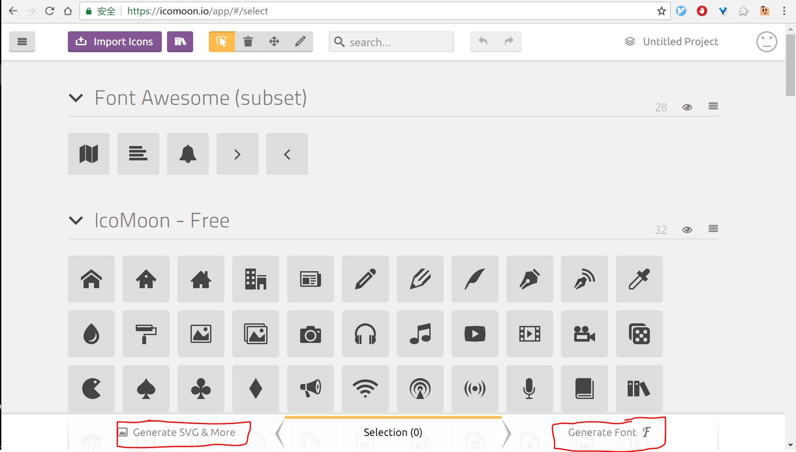

## 以图搜图

谷歌的 [以图搜图](https://images.google.com/?gws_rd=ssl) 准确率很高。同样的一幅人物图，百度、360、搜狗都只是对相似衣物、相似相貌进行匹配，且匹配并不精准。而谷歌可以对图源进行搜索。当然，也有可能是因为图源在 Twitter 上的关系。

## 汉字俄罗斯方块

设计师 ARAMA 构思的一款“汉字”游戏， 通过将多单字合并成一个字，来消除方块。

[地址在这](https://m.weibo.cn/detail/4266002730852762)

<!-- more -->

## icomoon

Font Awesome 的字体图标虽然够齐全，但是体积太大。[icomoon](https://icomoon.io/app/#/select) 允许你自己挑选需要的图标，可以选择生成字体图标或者 SVG。

## WebGL 与 threejs

可以选择 [mrdoob](https://github.com/mrdoob/three.js) 或者 [hewebgl](http://www.hewebgl.com/) 学习 WebGL。或者中文翻译版的 [techbrood](http://techbrood.com/threejs/docs/)。