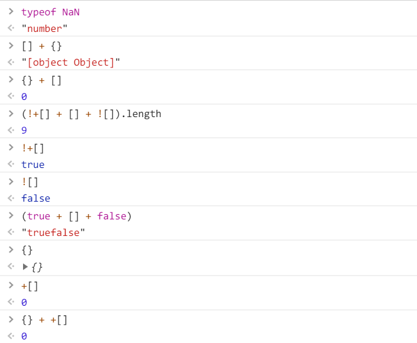

## 从 1 到正无穷的正整数之和等于 -1 / 12？

无意中看到的一篇文章，证明所有自然数之和是 -1 / 12。这篇文章是对结果的科普。

[文章地址](https://mp.weixin.qq.com/s?__biz=MjM5MDE3OTk2Ng==&mid=400402953&idx=1&sn=dd1594b88dcfbda4c5547a9944494b5c&key=564c3e9811aee0ab2959a5cacd5f1edb346719f358b05cce997afe6154fb4f084bf16f3b453a938fa5b193f432b4a0d4f27fb5f18dbe91066d7c7ea1f36092562f4cc54cf3432750b3a4ab3f4219f22a&ascene=0&uin=MjQwODY5NDU0Mw==&devicetype=android-18&version=26032030&nettype=WIFI&abtest_cookie=AQABAAgAAQAfhh4AAAA=&pass_ticket=F%20gWosumXYxWv9kZajdJfvlDHPv29bOKN7JDYAVfvIM6NfUzfbGsBY4/8RTGpm2o&wx_header=1#scene=7#wechat)

## 市值万亿的 Apple

Apple、Amazon、Microsoft、Google、Facebook，都是有实力市值过万亿的企业。

我国也曾经出现过市值超万亿的公司，不过只持续了一天。

<!-- more -->

## 拼多多上市

听说拼多多的商业模式吸引了很多跟风的人，还有一堆“拼夕夕”的跟风 app。

使用过它的 app，食品的价格与其他电商无异。

## 神秘的 JavaScript

