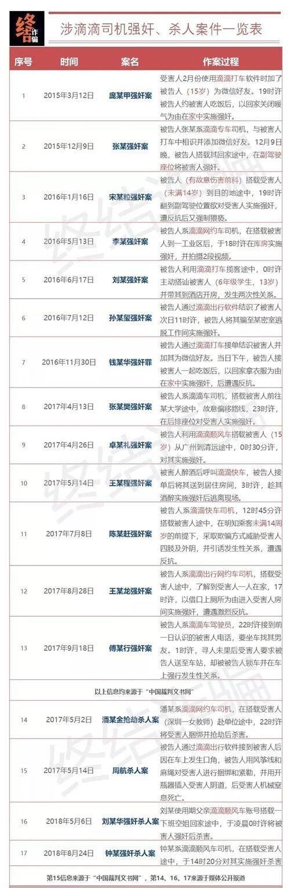

## 多走一步

假如一件事做完，需要 9 分精力付出，那么一件事做得出彩，可能只需要 10 分精力付出，这也就是所谓“多想一步”和“超预期”的意思。

其实绝大多数时候一件事做完以后只需要多往前走一步，就可以把这件事做得非常好，而市场上绝大多数人又都是只把事情做完的，那么这多 1 分努力的边际效应非常之大，带来的就是完全不一样的突出效果，资源将会以极大的差距向 10 分聚集，而 9 分就变得无人问津。

<!-- more -->

这 1 分其实是整个这件事的付出里最值得、回报率最高的 1 分，可惜大多数人都停在了 9 分的地方。

> 来源：即刻 Yifei_You

## 滴滴顺风车

来源：[顺风车女掌门的奋斗史](https://mp.weixin.qq.com/s/GvvhX2l_sCOyEycZEiTIww)

> *这是从来没有存在过的一个场景，就像咖啡馆、酒吧一样，私家车也能成为一个半公开、半私密的社交空间。* 
>
> *这是一个非常有未来感、非常 sexy 的场景，我们从一开始就想得非常清楚，一定要往这个方向打。*

这是黄洁莉在接受网易科技访问时的“名言”。

我不知道打个车为什么要 sexy。

## 通勤时间做什么

利用通勤时间来学习新知识，在我看来，有些不切实际；只是复习、巩固的话还好。

上班时，可以用来转换心情，从居家模式切换到工作模式，为进入工作状态做准备。

下班时，可以回想一天的工作内容，有没有学到什么，存在的问题与改进的方法。同时转换心情，不要把工作中累积的坏心情带回家里。