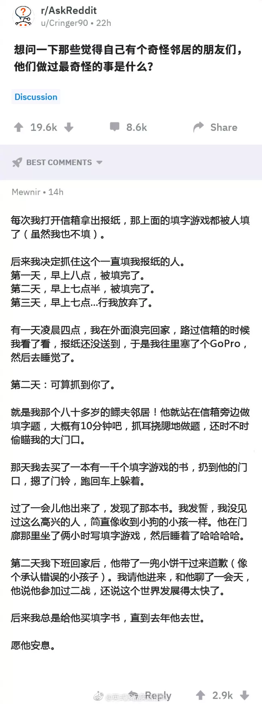

## 大学

“工地上收到北大录取通知”的少年，会度过什么样的大学时光呢？

[考上北大，然后呢](https://mp.weixin.qq.com/s?__biz=MzIwMjA4MzcwMA==&mid=2649822443&idx=2&sn=7ee1d6be4c8315404cd9230810ec5e42&chksm=8ee1a8f0b99621e6d1652592dbe33333b5ff9de885930d89e5b69245d8a19e085f5f56603a23&mpshare=1&scene=2&srcid=0906RdKt4QMqgBAkmfxL1Oka&from=timeline&ascene=2&devicetype=android-26&version=26070239&nettype=WIFI&abtest_cookie=AwABAAoACwATAAMAJpceAE2ZHgBimR4AAAA%3D&lang=zh_CN&pass_ticket=9WgsZOcZ4szjtpebsvy7XPxmdLYjhlPZm2mpXgYrDVm6u4Kccqf0sNky6grI5gHq&wx_header=1)。

## 用户隐私

[美英加澳新五国要求科技公司“开后门”，获取用户隐私信息](http://zhuanlan.zhihu.com/p/43823345)。但暂时并不用担心， 因为目前尚未真正执行。

 需要担心的是另一件事：远程监控。

一套远程监控软件，实时监控员工在电脑上的一切操作，实情如何尚不知晓，但如果真的有这样的软件，那将会是一场噩梦。

[原文](http://mp.weixin.qq.com/s?__biz=MzA5MTI1NjUxOA==&mid=2247483907&idx=1&sn=eac41540027b3c7d365c6605665c9e1d&chksm=907e61aaa709e8bc1166ec9b890eb1d82ff6b1fffaa9c76c40c6efb1668319b321286422f859&mpshare=1&scene=24&srcid=09081o4zgx4kURUEWS8ZrmW5#rd)。

<!-- more -->

## 番茄应用

[番茄ToDo](http://app.mi.com/details?id=com.plan.kot32.tomatotime)，可能不是最好用的一个，但用得很舒服。

有学霸模式（只能使用白名单应用），也有定时学霸模式，现在还有睡眠时间锁定手机、设置事件倒计时并作为小组件放到桌面上。

## 小故事

