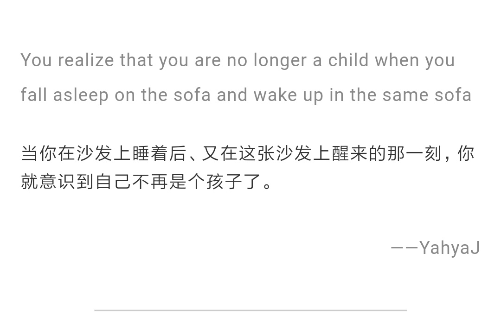

<!-- more -->

## 创业课程

[这篇文章](http://blog.xdite.net/posts/2018/09/09/besides-cs183b-what-kind-of-entrepreneurial-courses-do-you-have) 提供了一些 Youtube 上的创业课程和频道。

## Java

[JavaWorld](https://www.javaworld.com/) 是一个不错的 Java 学习网站。

[What is the JRE](https://www.javaworld.com/article/3304858/learn-java/what-is-the-jre-introduction-to-the-java-runtime-environment.html)，[What is the JDK](https://www.javaworld.com/article/3296360/core-java/what-is-the-jdk-introduction-to-the-java-development-kit.html)，[What is the JVM](https://www.javaworld.com/article/3272244/core-java/what-is-the-jvm-introducing-the-java-virtual-machine.html)。

## grunt 使用教程

grunt 可以替我们自动化代码压缩、编译、单元测试、代码检查等。

[【grunt第一弹】30分钟学会使用grunt打包前端代码](https://www.cnblogs.com/yexiaochai/p/3594561.html)

[【grunt第二弹】30分钟学会使用grunt打包前端代码（02）](https://www.cnblogs.com/yexiaochai/p/3602002.html)

[【grunt第三弹】grunt在前端实际项目中的应用](https://www.cnblogs.com/yexiaochai/p/3603319.html)

[【grunt整合版】30分钟学会使用grunt打包前端代码](https://www.cnblogs.com/yexiaochai/p/3603389.html)

## “上海复大医院”

宁波一位患者想去**复旦大学附属医院**治疗鼻炎，通过百度查询之后搜索到的结果却是“复大医院”。在“复大医院”花费近万元手术费后，发现百度到的“复大医院”并不是“复旦大学附属医院”。最终到复旦大学附属医院就医时，医生说开两副药就可以了。

[百度紧急回应“上海复大医院”推广事件](http://www.williamlong.info/archives/5458.html)。