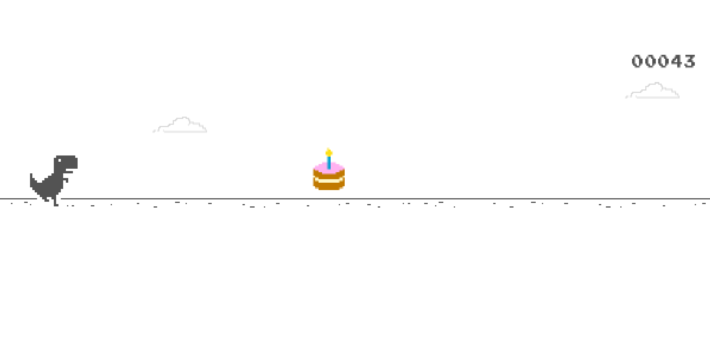
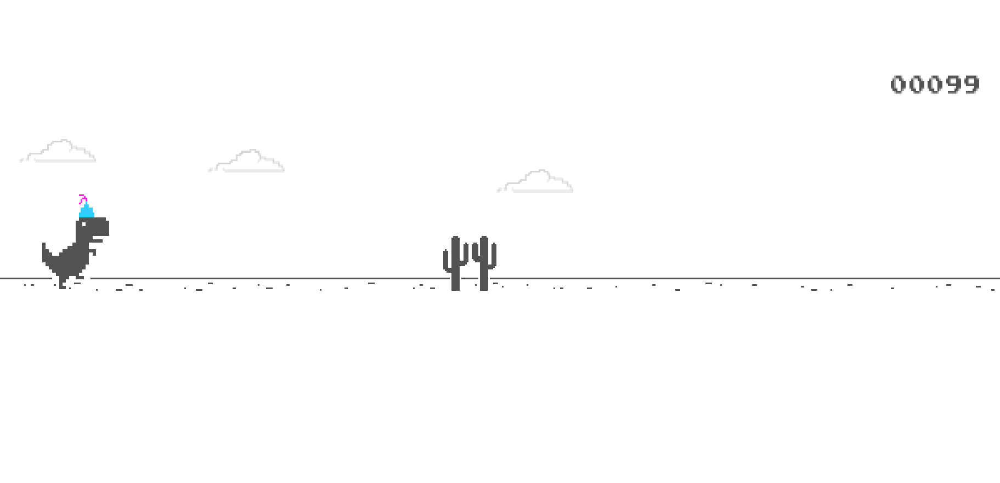
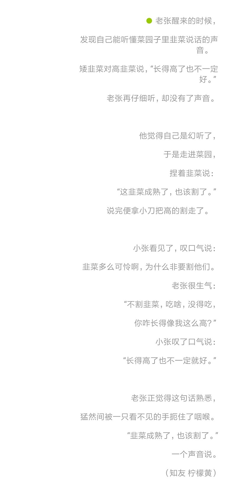
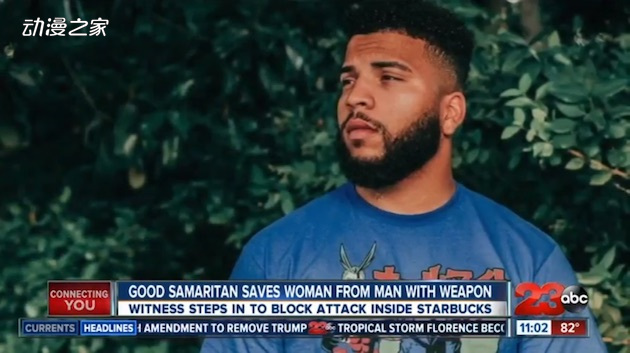

## Chrome 小恐龙

当断开网络连接时，或者在搜索框中键入 `Chrome://dino` 时，就会进入这个页面：

<!-- more -->

此时按下 `Space` 键，就会开始小恐龙跑酷游戏。正值 Chrome 十周年，现在小恐龙还可以“吃”到蛋糕，戴着生日帽，在黑夜模式下跑酷。

如果有哪位朋友想要跑完全程，抵达终点，那么可能要令你失望了，因为小恐龙会持续地跑 1700 万年。

来源：[Chrome 小恐龙背后的故事 | 设计师专访](http://zhuanlan.zhihu.com/p/44929548)

---

## "All night - no friends, nothing"

- 特斯拉 CEO 马斯克在纽约时报采访中谈到，最近他**每周工作 120 小时**。
- 他的 47 岁生日就在办公室中，一个人度过，全天都在工作。
- 最近一次连休 7 天之久的长假，是在 20 年前。

“通宵，没有朋友，什么都没有。”

采访中马斯克几度哽咽。

## 李雷和韩梅梅

系列 1：[3个步骤，掏空普通女青年，顺便毁掉她](https://zhuanlan.zhihu.com/p/38343742)

系列 2：[3个步骤，杀死普通男青年，顺便拯救他](https://zhuanlan.zhihu.com/p/38429769)

系列 3：[当消费主义遇到消费降级，谁来拯救被收割的韭菜？](https://zhuanlan.zhihu.com/p/44489434)

摘要：

- 消费降级所冲击的，其实是那些有一定消费能力和消费需求却又不能像土豪那样任性消费的中产阶级。
- 于是，当身边的人们一点一点地适应着消费降级的生活，这些被消费主义蛊惑的人们却仍在绝望的深渊里苦苦挣扎，而他们也正是在消费降级的时代里哀嚎得最惨烈的那一批人。

- 在消费降级的哀嚎声里，她们（收割者）踏过一片绿油油的韭菜地……
  然后迎来了体面而潇洒的消费升级。

----

## 割韭菜

----

## 漫迷见义勇为

本月 9 日，美国加利福尼亚州的一家星巴克中，发生了一起持利器行凶的案件。恰好看到案件发生的美国音乐家Blaine Hodge，面对歹徒没有逃跑，反而为保护遭到侵害的陌生女性而与歹徒对峙。最终歹徒被警方逮捕，Blaine Hodge 和女性都受了不同程度的伤。其中 Blaine Hodge 伤势较重，需要接受手术。据悉，这次的案件是由家暴引起的。

Blaine Hodge 表示，自己之所以会这样做，是因为受到了动画《我的英雄学院》的影响。而且在其个人的推特中，还写有“动画拯救了我的人生”的文字。另外身为音乐家的 Blaine Hodge，在这个月发售的专辑的名称正好也是《The Mind of a Hero》。

来源：[动漫之家：《我的英雄学院》粉丝在现实中奋勇从歹徒手中保护陌生人](https://mnews.dmzj.com/article/47160.html)

