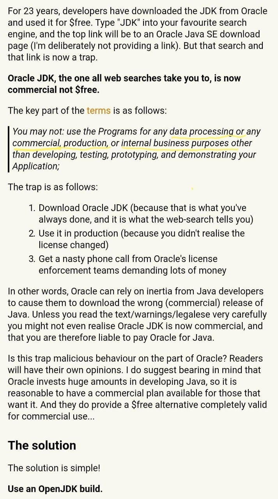

## JDK11 发布

JDK11 于 2018 年 9 月 25 日发布，这次更新引入了 ZGC 回收器，它能保证暂停时间在 10ms 以内。

什么是 ZGC，请看 [ZGC回收器到底有多变态？](https://mp.weixin.qq.com/s?__biz=MzA5MzQ2NTY0OA==&mid=2650797698&idx=1&sn=c481cd69c01560d6594e3f33d273f265&chksm=88562bddbf21a2cb3f879e39f482cb2d960882f3e09fb56e48062a75c07da11eb59933280119&scene=21#wechat_redirect)。

另外， JDK11 移除了 JavaFX 11，JavaFX 11 将作为一个独立模块，在使用时，开发者需要显示地引入。

另一项重大举措是 Java 不再免费，新版 Oracle JDK 不可用于数据处理任何商业、产品、内部商业目的，仅可用于开发、测试、原型与演示。

<!-- more -->

解决方案也很简单，使用 OpenJDK build。

## You Don't Need jQuery

前端发展很快，现代浏览器原生 API 已经足够好用。我们并不需要为了操作 DOM、Event 等再学习一下 jQuery 的 API。同时由于 React、Angular、Vue 等框架的流行，直接操作 DOM 不再是好的模式，jQuery 使用场景大大减少。本项目总结了大部分 jQuery API 替代的方法，暂时只支持 IE10 以上浏览器。

GitHub 项目地址在 [这里](https://github.com/nefe/You-Dont-Need-jQuery/blob/master/README.zh-CN.md)。

## Upgrading GitHub from Rails 3.2 to 5.2

为 GitHub 这种体量的应用更新并不是容易事，它要求完善的计划，良好的组织以及耐心。

如何进行更新升级：

- 及早更新、经常更新。越是拖下去，技术债欠地越多。
- 增量更新。
- 避免使用私有 API。

原文地址在 [这里](https://githubengineering.com/upgrading-github-from-rails-3-2-to-5-2/)。

## 10 practices for readable code

10 个编码实践，用于提升代码可读性、减小代码复杂程度。

- 代码格式。<kbd>Tab</kbd> 还是 <kbd>Space</kbd>，一行代码应该多长，什么地方换行，赋值语句左对齐还是等号对齐。等等。

- 使用对象。

- 良好命名。

- “三”定律。举三个实例来说明，而不是高度抽象。毕竟，重复远比错误的抽象来得便宜。

  > Sandi Metz: *duplication is far cheaper than the wrong abstraction.*

原文地址在 [这里](https://jason.pureconcepts.net/2018/09/practices-write-readable-code-less-complex/)。

## 俄罗斯方块

GitHub 上一个开源项目，网页版 *俄罗斯方块* 游戏。

[在线试玩](https://chvin.github.io/react-tetris/)。项目地址在 [这里](https://github.com/chvin/react-tetris)。

## 瑞典在玩火

9月21日，瑞典电视台公然播出辱华视频。

节目所出示的中国地图，明目张胆地缺失了台湾省和西藏部分地区。

接着，节目主持人嘲笑在九月初和瑞典警方发生纠纷的曾先生的母亲。

将她说的“救命啊”音译成“killing me now（现在就杀了我）”。

转载自：[瑞典电视台侮辱全体中国人，死不道歉还称中国人不懂幽默？](http://zhuanlan.zhihu.com/p/45235980)

然而这篇文章已经 **被删除** 了。