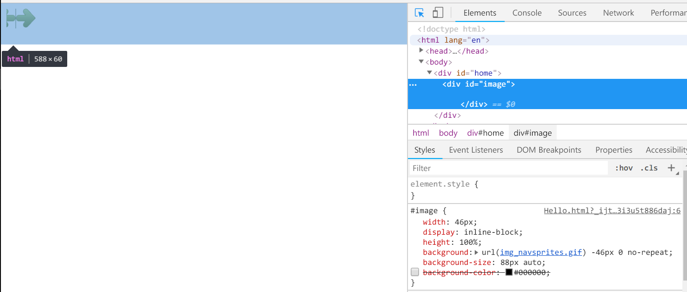

## 图像拼合

图像拼合就是单个图像的集合。


使用图像拼合可以降低服务器的请求数量，节省带宽。

以下为图像拼合技术的实际应用。

<!-- more -->



``` html
<!DOCTYPE html>
<html lang="en">
<head>
    <meta charset="UTF-8">
    <style>
        #image {
            
            width: 46px;
            display: inline-block;
            height: 100%;
            /* 
            以 img_navsprites.gif 为背景图，
            -46px 表示图片水平左移 46px，
            */
            background: url(img_navsprites.gif) -46px 0 no-repeat;
            /* 
            88px 表示原始图像宽度缩小为 88px（原始宽度 134px），高度 auto 为自适应。
            注意，图像 resize 后 -46px 也要适当放大或缩小。
            */
            background-size: 88px auto;
            /*background-color: #000000;*/
        }

        #home {
            width: 100%;
            height: 44px;
            border: 3px;
        }
    </style>
    <title>HELLO</title>
</head>
<body>
<div id="home">
    <div id="image">

    </div>
</div>
</body>
</html>
```

> 如果使用 `img` 标签就不得不找一张透明图片占位。