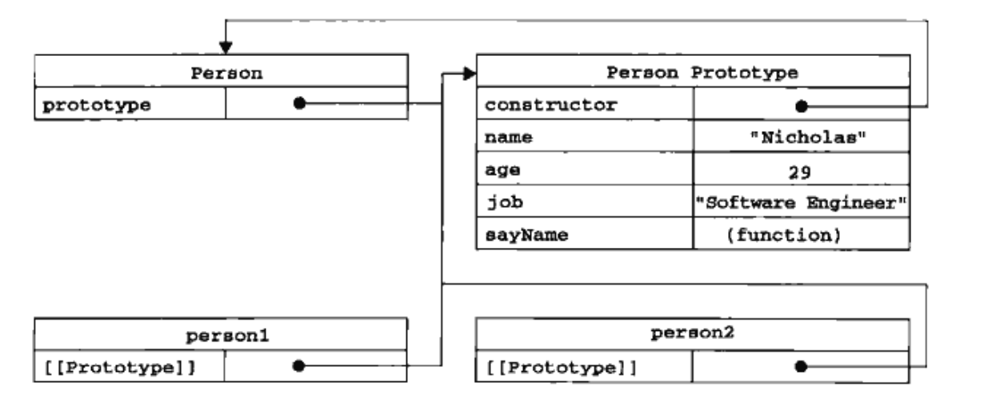

## 理解对象

### 属性类型

ECMAScript 中有两种属性：数据属性和访问器属性。

#### 数据属性

数据属性包含一个数据值我位置。数据属性有 4 个描述其行为的特性。

- [[Configurable]]，默认为 true。
- [[Enumerable]]，默认为 true。
- [[Writable]]，默认为 true。
- [[Value]]，默认为 undefined。

<!-- more -->

要修改属性默认的特性，必须使用 ECMAScript 5 的 `Object.definePropety()` 方法。这个方法接收三个参数：属性所在的对象、属性的名字和一个描述符对象。

``` javascript
var person = {};
Object.defineProperty(person, 'name', {
    writable: false,
    value: 'Nicholas'
});

console.log(person.name); // Nicholas
person.name = 'Greg';
console.log(person.name); // Nicholas
```

把 configurable 设置为 false，表示不能从对象中删除属性。如果对这个属性调用 delete，则在非严格模式下什么也不会发生，而在严格模式下会导致错误。而且，一旦把属性定义为不可配置的，就不能再把它变回可配置了。

#### 访问器属性

访问器属性不包含数据值；它们包含一对 getter 和 setter 函数（两个函数都不是必需的）。

访问器属性有 4 个特性：

- [[Configurable]]，默认为 true。
- [[Enumerable]]，默认为 true。
- [[Get]]，默认为 undefined。
- [[Set]]，默认为 undefined。

访问器属性必须使用 `Object.defineProperty()` 来定义。

``` javascript
var book = {
    // 下划线是常用记号，表示只能通过对象方法访问的属性，也是
    // 避免递归调用 set 方法。
    _year: 2004,
    edition: 1
};

Object.defineProperty(book, "year", {
    get: function () {
        return this._year;
    },
    set: function (newValue) {
        if (newValue > 2004) {
            this._year = newValue;
            this.edition += (newValue - 2004);
        }
    }
});

book.year = 2005;
console.log(book.edition);
console.log(book._year);
```

不一定同时指定 getter 和 setter。只指定 getter 意味着属性不能写入。

使用 `Object.defineProperties()` 方法可以一次定义多个属性。

使用 `Object.getOwnPropertyDescriptor()` 方法可以取得给定属性的描述符。

## 创建对象

### 工厂模式

使用函数来封装以特定接口创建对象的细节。

``` javascript
function createPerson(name, age, job) {
    var o = {};
    o.name = name;
    o.age = age;
    o.job = job;
    o.sayName = function () {
        console.log(this.name);
    };
    return o;
}

var person1 = createPerson('Nicholas', 29, 'Software Engineer');
var person2 = createPerson('Greg', 27, 'Doctor');
```

### 构造函数模式

``` javascript
function Person(name, age, job) {
    this.name = name;
    this.age = age;
    this.job = job;
    this.sayName = function () {
        console.log(this.name);
    }
}

var p1 = new Person('Nicholas', 29, 'Software Engineer');
var p2 = new Person('Greg', 27, 'Doctor');
p1.sayName();
```

要创建 Person 的新实例，必须使用 new 操作符。以这种方式调用构造函数 会经历以下 4 个步骤：

1. 创建一个新对象；
2. 将构造函数的作用赋给新对象（因此 this 就指向了这个新对象）；
3. 执行构造函数中的代码（为这个新对象添加属性）；
4. 返回新对象。

创建自定义的构造函数意味着将来可以将它的实例标识为一种特定的类型，这正是构造函数用过工厂模式的地方。

> 构造函数的问题：ECMAScript 中的函数是对象，每定义一个函数，也就是实例化了一个对象。因此 ，不同实例上的同名函数是不相等的。
>
> 将函数的定义转移到构造函数外部，构造函数内保留一个指向函数的指针，以此来解决两个函数做同一件事的问题。但是新问题是封装性被破坏。

### 原型模式

我们创建的每个函数都有一个 prototype 属性，这个属性是一个指针，指向一个对象，而这个对象的用途是包含可以由特定类型的所有实例共享的属性和方法。

``` javascript
function Person() {

}

Person.prototype.name = 'Nicholas';
Person.prototype.age = 29;
Person.prototype.job = 'Software Engineer';
Person.prototype.sayName = function () {
    console.log(this.name);
};

var p1 = new Person();
p1.sayName();

var p2 = new Person();
p2.sayName();

console.log(p1.sayName === p2.sayName);
```

#### 理解原型对象

无论什么时候，只要创建了一个新函数，应付根据一组特定的规则为该函数创建一个 prototype 属性，这个属性指向函数的原型对象。在默认情况下，所有原型对象都会自动获得一个 constructor 属性，这个属性包含一个指向 prototype 属性所在函数的指针。即 `Person.prototype.constructor` 指向 Person。

创建了自定义的构造函数之后，其原型对象默认只会取得 constructor 属性；其他方法都是从 Object 继承而来的。

`Object.getPrototypeOf()` 方法返回 [[Prototype]] 的值。

每当代码读取某个对象的某个属性时，都会执行一次搜索，目标是具有给定名字的属性。搜索首先从对象实例本身开始。如果在实例中找到了具有给定名字的属性，则返回该属性的值；如果没有找到，则继续搜索指针指向的原型对象，在原型对象中查找具有给定名字的属性。

这即是多个对象实例共享原型所保存的属性和方法的基本原理。

虽然可以通过对象实例访问保存在原型中的值，但却不能通过对象实例重写原型中的值。

``` javascript
var p1 = new Person();
p1.name = 'Greg';
p1.sayName();       // Greg 来自实例
delete p1.name;
p1.sayName();		// Nicholas 来自原型

var p2 = new Person();
p2.sayName();       // Nicholas
```

使用 `hasOwnProperty()` 方法可以检测一个属性是存在于实例中还是存在于原型中。这个方法（从 Object 继承来的）只在给定属性存在于对象实例中时，才会返回 true。

#### 原型与 in 操作符

有两种方式使用 in 操作符：单独使用和在 for-in 循环中使用。在单独使用时， in 操作符会在通过对象能够访问给定属性时返回 true，无论该属性存在于实例中还是原型中。

### 寄生构造函数模式

``` javascript
function SpecialArray() {
    var values = [];

    values.push.apply(values, arguments);
    values.toPipedString = function () {
        return this.join('|');
    };
    return values;
}
var colors = new SpecialArray('red', 'blue', 'green');
console.log(colors.toPipedString());
```

返回的对象与构造函数的原型属性之间没有关系。为此，不能依赖 instanceof 操作符来确定对象类型。

### 稳妥构造函数模式

不引用 this，没有公共属性。

## 继承

### 原型链

通过实现原型链，本质上扩展了原型搜索机制。

给原型添加方法的代码一定要放在替换原型的语句之后。

原型链的问题：

- 包含引用类型值的原型。
- 在创建子类型的实例时，不能向超类型的构造函数中传递参数。

### 借用构造函数

``` javascript
function SuperType() {
    this.colors = ['red', 'blue', 'green'];
}

function SubType() {
    SuperType.call(this);
}

var instance1 = new SubType();
instance1.colors.push('black');
console.log(instance1.colors); // [ 'red', 'blue', 'green', 'black' ]

var instance2 = new SubType();
console.log(instance2.colors); // [ 'red', 'blue', 'green' ]
```

相对于原型链而言，借用构造函数可以在子类型构造函数中向超类型构造函数传递参数。

但是难以实现函数复用。

### 组合继承

``` javascript
function SuperType(name) {
    this.name = name;
    this.colors = ['red', 'blue', 'green'];
}

SuperType.prototype.sayName = function () {
    console.log(this.name);
};

function SubType(name, age) {
    SuperType.call(this, name);

    this.age = age;
}

SubType.prototype = new SuperType();
SubType.prototype.sayAge = function () {
    console.log(this.age);
};

var instance1 = new SubType('Nicholas', 29);
instance1.colors.push('black');
console.log(instance1.colors); // 
instance1.sayName();
instance1.sayAge();

var instance2 = new SubType('Greg', 27);
console.log(instance2.colors);
instance2.sayName();
instance2.sayAge();
/*
[ 'red', 'blue', 'green', 'black' ]
Nicholas
29
[ 'red', 'blue', 'green' ]
Greg
27
 */
```

### 原型式继承

`Object.create()`

### 寄生式继承

``` javascript
function createAnother(original) {
    var clone = object(original);
    coloe.sayHi = function() {
        console.log('hi');
    };
    return clone;
}
```

### 寄生组合式继承

组合继承最大的问题就是无论什么情况下，都会调用再次超类型构造函数。

``` javascript
function inheritPrototype(subType, superType) {
    var prototype = object(superType.prototype); // 创建对象
    prototype.constructor = subType;		// 增强对象
    subType.prototype = prototype;		// 指定对象
}
```

