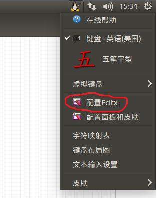
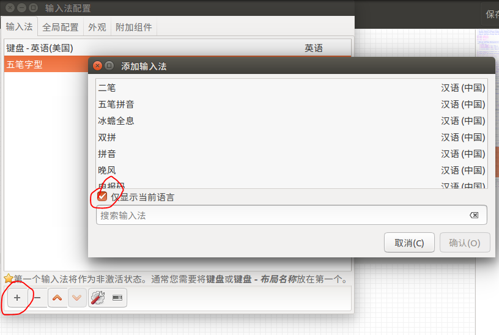

##  安装 Fcitx 五笔输入法

输入命令行参数：

```bash
$ sudo apt-get install fcitx-table-wbpy fcitx-config-gtk
```

## 如何从 ibus 切换到 Fcitx

在 `系统设置->语言支持->键盘输入法系统：ibus`，将 `ibus` 更改为 `Fcitx`，**重启** 即可。

## 添加五笔输入法

点击 **小键盘**


<!-- more -->

选择 **配置Fcitx**



然后点击 **+** 号，勾选 **仅显示当前语言**，添加 **五笔字形** 输入法。

