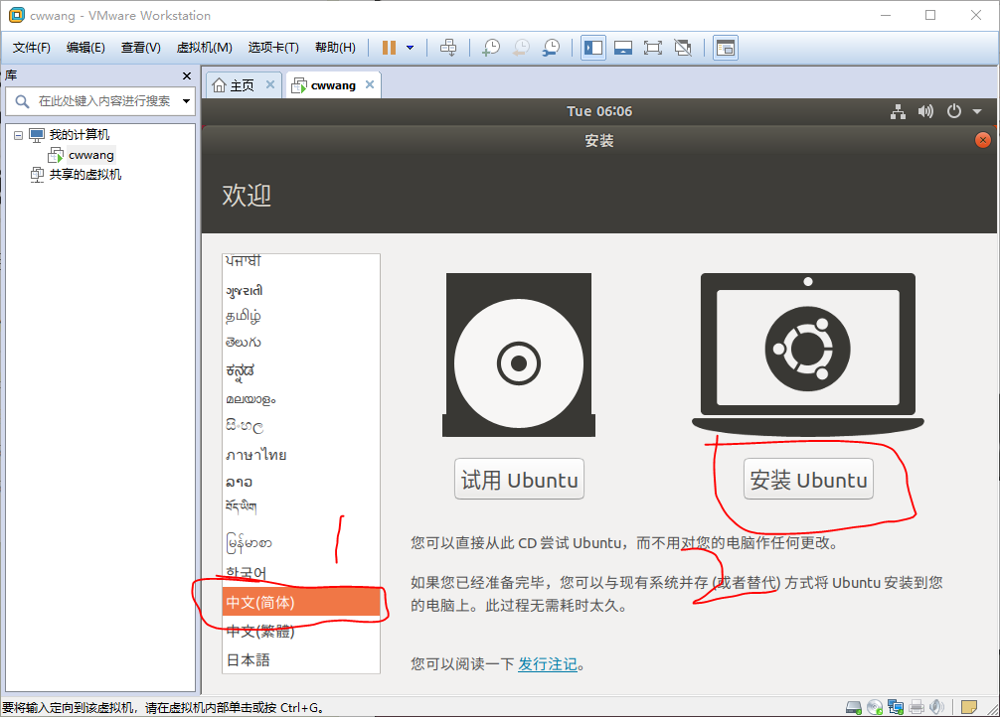

## 下载 Ubuntu 镜像  

由于课程作业需要在 `linux` 环境下编程，所以安装了 `Ubuntu`，现在的最新版是 `18.04 LTS`，下载地址在 [这里](https://www.ubuntu.com/)，选择 `Ubuntu Desktop` 下载即可。VMware 的安装不用多说，百度或者谷歌下载即可。

<!-- more -->

## 创建虚拟机

## 选择“自定义（高级）”

## 稍后安装 OS

## 选择 Linux 64 位

## 选择安装目录

注意，这个目录必须是已存在的！

## 存储为单个文件

## 自定义硬件

## 设置 OS

## 启动虚拟机

## 选择语言为中文

## 开始安装

时间会比较长，耐心等待。

## 安装完成

此时需要重新启动虚拟机，但是点下“重新启动”按钮后它并不会重新启动，这里只要关机再重启就好了。

## 安装 VMware-Tools

在 VMware 选项卡中，选择 `虚拟机(M)` 一栏，点击 `安装 VMware-Tools `。

然后会发现左侧任务栏出现有 `DVD` 字样的图标，点击图标进入文件系统，拷贝其中的 `.tar` 文件到本地任意目录下，使用 `tar xvf xxx.tar` 命令解压，然后使用 `sudo ./vmware-install.pl` 命令安装。

## 问题解决

有的电脑可能没有支持虚拟化，需要进入 bios 界面设置。

进入 bios 界面后选择 `Security -> Virtualization`，将与虚拟化字眼相关的 `Disabled` 改为 `Enabled` 即可。