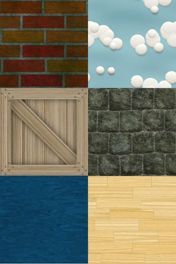

## UV 映射

整理自 [深入理解Three.js（WebGL）贴图（纹理映射）和UV映射](http://www.techbrood.com/zh/news/webgl/%E6%B7%B1%E5%85%A5%E7%90%86%E8%A7%A3three_js%E7%BA%B9%E7%90%86%E8%B4%B4%E5%9B%BE%E5%92%8Cuv%E6%98%A0%E5%B0%84.html)。

示例程序来自 [iefreer](http://wow.techbrood.com/fiddle/28348)。

3D 模型有很多的面，为每个面创建贴图是不现实的。

UV 映射最典型的例子是把一张地图映射到 3D 球体的地球仪上去。其本质是把平面图像上的不同区域映射到 3D  模型的不同面上去。

使用 UV 映射时，图片只加载一次，使用时为子图像重新绑定坐标。

<!-- more -->



``` javascript
var camera;
var scene;
var renderer;
var mesh;


init();
animate();

function init() {

    scene = new THREE.Scene();
    camera = new THREE.PerspectiveCamera(
        70,
        window.innerWidth / window.innerHeight,
        1,
        1000
    );

    let geometry = new THREE.CubeGeometry(10, 10, 10);

    let material = new THREE.MeshBasicMaterial({
        map: THREE.ImageUtils.loadTexture('./texture-atlas.jpg')
    });
    /*
    重新绑定坐标时，使用 百分比，并以左下角为坐标原点。
    所以 bricks 的坐标为：
    左上(.0, 1.0)   (.5, 1.0)右上
    
    左下(.0, .666)  (.5, .666)右下
    */
    var bricks = [
        new THREE.Vector2(0, .666),
        new THREE.Vector2(.5, .666),
        new THREE.Vector2(.5, 1),
        new THREE.Vector2(0, 1)
    ];
    var clouds = [
        new THREE.Vector2(.5, .666),
        new THREE.Vector2(1, .666),
        new THREE.Vector2(1, 1),
        new THREE.Vector2(.5, 1)
    ];
    var crate = [
        new THREE.Vector2(0, .333),
        new THREE.Vector2(.5, .333),
        new THREE.Vector2(.5, .666),
        new THREE.Vector2(0, .666)
    ];
    var stone = [
        new THREE.Vector2(.5, .333),
        new THREE.Vector2(1, .333),
        new THREE.Vector2(1, .666),
        new THREE.Vector2(.5, .666)
    ];
    var water = [
        new THREE.Vector2(0, 0),
        new THREE.Vector2(.5, 0),
        new THREE.Vector2(.5, .333),
        new THREE.Vector2(0, .333)
    ];
    var wood = [
        new THREE.Vector2(.5, 0),
        new THREE.Vector2(1, 0),
        new THREE.Vector2(1, .333),
        new THREE.Vector2(.5, .333)
    ];

    geometry.faceVertexUvs[0] = [];
    /*
    WebGL 中的面都是三角化的，所以四边形用 2 个三角形来表示。
    记得两个三角形的顶点按逆时针写出
    
    3 --- 2
    |  \  |
    0 --- 1
    */
    geometry.faceVertexUvs[0][0] = [bricks[0], bricks[1], bricks[3]];
    geometry.faceVertexUvs[0][1] = [bricks[1], bricks[2], bricks[3]];

    geometry.faceVertexUvs[0][2] = [clouds[0], clouds[1], clouds[3]];
    geometry.faceVertexUvs[0][3] = [clouds[1], clouds[2], clouds[3]];

    geometry.faceVertexUvs[0][4] = [crate[0], crate[1], crate[3]];
    geometry.faceVertexUvs[0][5] = [crate[1], crate[2], crate[3]];

    geometry.faceVertexUvs[0][6] = [stone[0], stone[1], stone[3]];
    geometry.faceVertexUvs[0][7] = [stone[1], stone[2], stone[3]];

    geometry.faceVertexUvs[0][8] = [water[0], water[1], water[3]];
    geometry.faceVertexUvs[0][9] = [water[1], water[2], water[3]];

    geometry.faceVertexUvs[0][10] = [wood[0], wood[1], wood[3]];
    geometry.faceVertexUvs[0][11] = [wood[1], wood[2], wood[3]];

    mesh = new THREE.Mesh(geometry, material);
    mesh.position.z = -50;
    scene.add(mesh);

    renderer = new THREE.WebGLRenderer();
    renderer.setSize(window.innerWidth, window.innerHeight);
    document.body.appendChild(renderer.domElement);

    // window.addEventListener('resize', onWindowResize, false);

    render();
}

function animate() {
    mesh.rotation.x += .04;
    mesh.rotation.y += .02;

    render();
    requestAnimationFrame(animate);
}

function render() {
    renderer.render(scene, camera);
}

```

