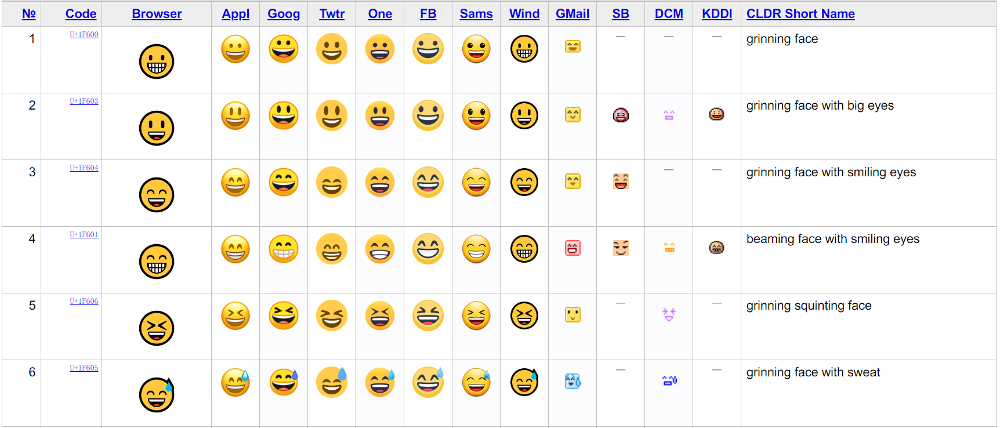

## Emoji 编码

Unicode 字符集中规定了一些 Emoji 的编码与含义，以下为一些实例：

- U+1F609：&#x1f609;
- U+1F60A：&#x1F60A;
- U+1F642：&#x1F642;

<!-- more -->



## 使用方法

```html
<p>&#1F609;</p>
```

## 完整 Emoji 编码

可以到 [这里](https://unicode.org/emoji/charts/full-emoji-list.html) 寻找所需 Emoji 的 Unicode 编码。

