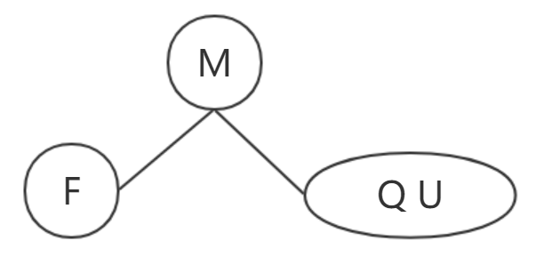

# 深入理解红黑树

在看这篇红黑树的介绍文章之前，您需要对二叉搜索树（BST）及红黑树有一定的了解。

这篇文章不会着重介绍如何旋转，以及插入、删除操作后几种情况的分析。而是针对红黑树与 2-3 树、2-3-4 树的联系来对红黑树的原理进行解析。

## 红黑树的性质

1. 每个结点要么是红色的，要么是黑色的
2. 根结点是黑色的
3. 叶子结点（NIL）是黑色的
4. 红色结点的子结点是黑色的
5. 对于每一个结点，所有简单路径下的黑结点个数相等（黑高度相等）。

## 2-3 树

首先是为什么引入 2-3 树的概念。这要从二叉树谈起。

二叉树是对输入数据敏感的，已经升序或降序排列的数据生成的二叉树性能很差，虽然这个问题可以用随机化来解决（每次随机选取序列中的元素，与快排殊途同归），但另一个问题：动态地插入与删除操作后树的高度会不平衡。究其原因，是每一个结点都只能决定新元素是“向左走”还是“向右走”，而不能决定新元素的去与留。如果每一个结点都有能力在某一条路径上的结点数目过多时，“留住”新元素，避免增加树的高度，那么不就能让二叉树保持动态地平衡了吗？而 2-3 树中的 3 结点就是用来实现“留住”元素功能的。

二叉树中的每个结点都能为二个子结点。顾名思义，2-3 树中的 2 表示可以容纳 1 个元素，拥有 2 个子结点；3 则表示可以容纳 2 个元素，拥有 3 个子结点。

