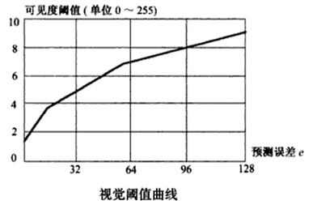
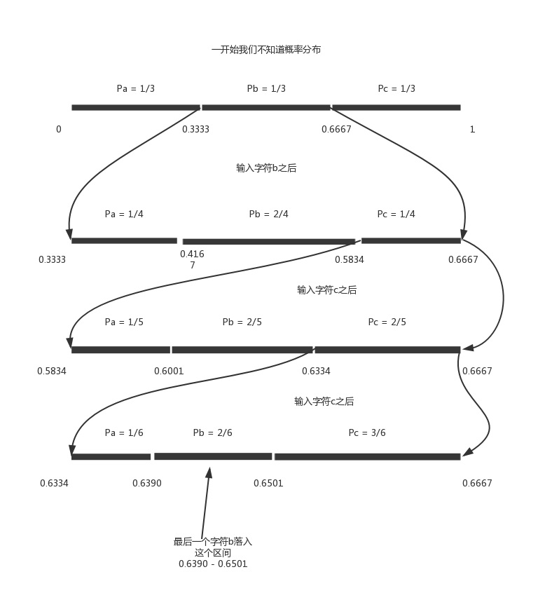

## 为什么进行图像压缩

设想这样一个情景：你录制了一部影片，画面大小 $1000 * 1000\ pixel$， 24 位真彩色，每秒 24 帧，时长 100 分钟。

​	如果不进行任何压缩，那么存储部影片将需要 $$1000 \ast 1000 \ast 24 \ast 24 \ast 60 \ast 100 =  3.456 \ast 10 ^{12} bits \approx 402  \ GB$$ 空间。而当下  1 TB 的移动移动硬盘的价格在 400 元左右。所以，对图像进行压缩编码从存储占用与利益得失的角度都是非常有必要的。

<!-- more -->

## 图像压缩的可能性

### 从图像本身角度


这是一幅雪花图片，可以看到，其中有大片的区域都是纯色的。对于纯色的、或者近似纯色的区域，如果不进行压缩，其中必然包含大量的冗余信息。我们可以只给出其颜色信息，以表示指定区域内的所有像素的颜色值，从而大大减少所需要的比特数，达到去冗余的效果，而不损失或损失极少的信息。

### 从人眼视觉特性角度

由对人眼所作的视觉特性实验表明，在亮度变化在的地方量化误差在一些也不会被人眼察觉。这种效应称为掩盖效应，量化时可以利用人眼的这种视觉特性。以预测编码为例，由于图像的内容一般都是连续变化的，因此帧内相邻像素之间的差值，或两帧图像对应像素之间的差值可以用较少的比特位表示，从而达到图像的效果。

下图（脚注 1）是人眼可见度阈值与预测误差的实验测量值：


可以看出，预测误差小的地方（相当于平坦区）视觉阈值也小，这里量化间隔要取小一点的值；预测误差在的区域相当于图像边缘部分，人眼对这些地方量化误差不敏感，这里可以量化得粗糙一些。

这样，利用人眼视觉特性，就可以在极少损失图像视觉效果的基础上实现压缩。

## 可用的图像压缩技术

压缩技术可以分为两类：有损数据压缩和无损数据压缩。

对于医疗图像或者用于存档的扫描图像等有价值的内容的压缩一般选择无损压缩方法，如游程编码、熵编码法、LZW 自适应字典算法；而对于自然图像，则适于使用有损方法，现有的技术有色度抽样和变换编码，其中色度抽样利用了人眼对于亮度的变化的敏感性远大于颜色变化，从而将图像中的颜色信息减少一半甚至更多。

### 算术编码

算术编码是一种无损数据压缩方法，于 $1976$ 年由 $J.Rissanen$ 提出，是一种可以成功地逼近信息熵极限的编码方法。接下来分别解释什么是信息熵极限，以及算术编码的的原理，为什么算术编码能够逼近信息熵极限。

#### 无损压缩的极限

压缩的原理就是找出重复出现的字符串，并用更短的符号代替，从而达到缩短字符串的目的。所以内容越是重复的文件，就可以压缩地越小。比如 $ABABABABABABAB$ 可以压缩为 $7AB$。相应地，如果内容毫无重复，就很难压缩，比如无理数 $\pi$。因此压缩的本质就是一个消除冗余的过程，相当于用一种更精简的形式，表达相同的内容。

一般来说，在均匀分布的情况下，假定一个字符（或字符串）在文件中出现的概率是 $p$，那么在这个位置上最多可能出现 $1 / p$ 种情况。需要 $\log_2(1 / p)$ 个二进制位表示替代符号。

这个结论可以推广到一般情况。假定文件有 $n$  个部分组成，每个部分的内容在文件中的出现概率分别为 $p_1,p_2, ... ,p_n$，那么，替代符号占据的二进制最少为下面这个式子。

> $\displaystyle&#123;k_1\log_2&#123;1 \over p_1&#125; + k_2\log_2&#123;1 \over p_2&#125; + ... + k_n\log_2&#123;1 \over p_n&#125;&#125;$
>
> $\displaystyle&#123;= \sum_&#123;i = 1&#125;^&#123;n&#125;&#123;k_i\log_2&#123;1 \over p_i&#125;&#125;&#125;$

将上式除以 $n$，可以得到平均每个符号所占用的二进制位。

> $\displaystyle&#123;\sum_&#123;i = 1&#125;^&#123;n&#125;&#123;k_i\log_2&#123;1 \over p_i&#125;&#125;&#125;$
>
> $\displaystyle&#123;= \sum_&#123;i = 1&#125;^&#123;n&#125;&#123;&#123;k_i \over n&#125;\log_2&#123;1 \over p_i&#125;&#125;&#125;$
>
> $\displaystyle&#123;= \sum_&#123;i = 1&#125;^&#123;n&#125;&#123;p_i\log_2&#123;1 \over p_i&#125;&#125;&#125;$
>
> $\displaystyle&#123;= - \sum_&#123;i = 1&#125;^&#123;n&#125;&#123;p_i\log_2&#123;p_i&#125;&#125;&#125;$

这就是信息熵，可以用来衡量文件内容的随机性（不确定性）。

#### 信息熵

信息熵（Information Entropy），是对信息的不确定度（Uncertainty）的度量，不确定性越大，信息熵越大。它的计算公式一般表示为：

> $\displaystyle&#123;H(X) = - &#123;\sum_&#123;x \in \chi&#125; &#123;p(x) \log&#123;p(x)&#125;&#125;&#125; &#125;$

因为计算机是二进制的，所以上式中的对数函数一般取 2 为底。

为了理解信息熵，先考虑这样一个例子：

100 米短跑比赛中，有四个选手 $\&#123;A, B, C, D\&#125;$，获胜概率分别是 $\displaystyle&#123;\&#123;&#123;1 \over 2&#125;, &#123;1 \over 4&#125;, &#123;1 \over 8&#125;, &#123;1 \over 8&#125;\&#125;&#125;$。接下来，把哪一位选手获胜视为随机变量 $X \in \&#123;A, B, C, D\&#125;$。

现在我们想要用尽可能少的二元问题（是或否，0 或 1）来确定随机变量$X$的取值。例如，问题 1：$A$ 获胜了吗？问题 2：$B$ 获胜了吗？问题 3：$C$ 获胜了吗？这样我们可以通过最多 3 个二元问题，来确定 $X$ 的取值，即哪一个选手赢了比赛。

- 如果 $X = A$，那么需要问1次（问题 1：是不是 $A$？），概率为 $\displaystyle&#123;1 \over 2&#125;$；

- 如果 $X = B$，那么需要问2次（问题 1：是不是 $A$？问题 2：是不是 $B$？），概率为 $\displaystyle&#123;1 \over 4&#125;$；

- 如果 $X = C$，那么需要问3次（问题 1，问题 2，问题 3），概率为 $\displaystyle&#123;1 \over 8&#125;$；

- 如果 $X = D$，那么同样需要问3次（问题 1，问题 2，问题 3），概率为 $\displaystyle&#123;1 \over 8&#125;$；

于是可以很容易计算，在这种问法下，为确定 $X$ 取值的二元问题数量的期望为：

> $\displaystyle&#123;E(N) = (&#123;1 \over 2&#125; \times 1) + (&#123;1 \over 4&#125; \times 2) + (&#123;1 \over 8&#125; \times 3) + (&#123;1 \over 8&#125; \times 3) = &#123;7 \over 4&#125; &#125;$

显然，为了尽可能减少问问题的数量，我们要给发生概率 $p(x)$ 较大的事件，分配较高的优先级 $l(x)$，即最早提问。如果给问题进行编码，那么 $\&#123;A, B, C, D\&#125;$ 四个事件，可以分别由 $\&#123;0, 10, 110, 111\&#125;$ 表示，显然我们要把最短的码 $0$ 分配给发生概率最高的事件 $A$。以此类推，使用平均码长的计算公式：$L(C) = &#123;\sum_&#123;x \in \chi&#125;p(x)l(x)&#125;$，我们得到的平均码长为 $1.75\ bits$。如果我们硬要反其道而行之，给事件 $A$ 分配一最长的码 $111$，那么平均码长变成 $2.625\ bits$。霍夫曼编码就利用了大概率事件分配短码的思想。

> 在二进制计算机中，一个比特为 0 或 1，其实就代表了一个二元问题的回答。也就是说，在计算机中，我们给哪一位选手夺冠这个事件进行编码，所需要的平均码长最少为 $1.75$ 比特。

当我们观察到随机变量 $X$ 的一个具体值的时候，我们接受到的信息量（随机变量从不知道取什么值到观察到具体取值所付出的代价，如问题数量）与此随机事件发生的概率有关：越小概率的事情发生了产生的信息量越大，其不确定性也越大；越大概率的事情发生了产生的信息量越小，其不确定性也越小，如太阳从东边升起，是必然事件，完全得不到有价值的信息。

信息量度量的是一个具体事件发生了所带来的信息，而信息熵则是在结果出来之前对可能产生的信息量的期望——考虑该随机变量的所有可能取值，即所有可能发生事件所带来的信息量的期望。

回到信息熵的定义，会发现通过之前的信息熵公式，得到了：

> $\displaystyle&#123;H(X) = &#123;1 \over 2&#125;\log_2&#123;2&#125; + &#123;1 \over 4&#125;\log_2&#123;4&#125; + &#123;1 \over 8&#125;\log_2&#123;8&#125; + &#123;1 \over 8&#125;\log_2&#123;8&#125; = &#123;1 \over 2&#125; + &#123;1 \over 2&#125; + &#123;3 \over 8&#125; + &#123;3 \over 8&#125; = &#123;7 \over 4&#125; bits&#125;$，

这是信息量的期望，信息熵的极限，也是文件无损压缩的极限。

#### 向极限挑战

哈夫曼编码效率高，运算速度快，实现方式灵活，在数据压缩领域得到了广泛的应用。但是 $Huffman$ 编码使用整数个二进制位对符号进行编码，这种方法在许多情况下无法得到最优的压缩效果。比如某个字符的出现概率为 $80\%$，该字符事实上只需要 $- \log_2&#123;0.8&#125; = 0.322$ 位编码，但是 $Huffman$ 编码一定会为其分配一位 0 或一位 1 的编码。这样，整个信息的 $80\%$ 在压缩后都几乎相当于理想长度的 3 倍，压缩效果可想而知。

算术编码对整条信息进行编码，其输出仅仅是一个介于 0 和 1 之间的二进制小数。其核心思想是为整个输入序列（而不是单个字符）分配码字，因而平均每字符可以分配长度小于 1 的码字。

现在考虑某条信息中可能出现的字符仅有 $a,b,c$ 三种，而我们要压缩的信息为 $bccb$。

在压缩之前，假设我们对 $a,b,c$ 三者在信息中的出现概率一无所知（自适应模型），我们暂时认为三者的出现概率相等，即都为 $1 / 3$。我们将 $[0,1]$ 区间按照概率的比例分配给三个字符。见下图（脚注 3）



然后我们在 $[0.6390 - 0.6501]$ 之间选择一个位数较少的数，比如 0.640625，然后把它变成二进制 0.10 1001，去掉 0 与小数点后的 10 1001 就是信息压缩后的结果。

要解压缩时，先加上 0 和小数点，并转换加十进制小数 0.64。这时我们发现 0.64 落入了字符 b 的区间（[0.3333 - 0.6667]），于是立即输出 b，并得出三个字符新的概率分布，以此类推，得到所有的字符（实际应用中还有休止符，以正确判断解压缩结束）。

这样，进行编码时，我们每输入一个符号，都对概率的分布表做一下调整，并将要输出的小数限定在某个越来越小的区间范围内。对输出区间的限定是问题的关键。在上述例子中，输出区间为 [0.6390 - 0.6501]，只有第一位的确切信息，即输出所有 4 个字符，只需要不到 2 个十进制位，换成二进制形式后，为 6 个 10 1001，接近了熵极限。但这只是 0 阶自适应模型，没有考虑上下文的因素。使用 2 阶或 3 阶自适应模型可以获得更好地效果，真正逼近无损压缩的熵极限。

算术编码的伪代码：

```pseudocode
Low <- 0
High <- 1
while there are input symbols
	take a symbol
	CodeRange = High - Low // 原来的输出区间
	High = Low + CodeRange * HighRange(symbol) // 新的输出区间的上界
	Low = Low + CodeRange * LowRange(symbol) //新的输出区间的下界
// 10 1001 与10 1000 的第一个不同的位置在6，这是为了让编码长度更短
find the first position i where charAt(Low, i) != charAt(High, i) 
ans <- High(0, i)
return ans
```

#### 缺点

- 实际的计算机有精度限制，要解决运算中溢出问题
- 对整个消息只产生一个码字，只能从头开始解码，不能直接从中间某个位置开始解码，也就是不能随机访问。但是哈夫曼编码可以。
- 复杂度高，运行速度慢于哈夫曼编码。
- 抗误码性能差，对错误敏感，如果有一位发生错误，后续位都会受到影响。

#### 实际应用情况与未来应用前景

算术编码作为一种高效的数据编码方法在文本，图像，音频压缩中有广泛的应用。不论是活动图像不是静止图像，采用算法编码得到的码流都比用哈夫曼编码得到的码流要短，编码效率高。但是到目前为止，算术编码还没有完全取代哈夫曼编码。在许多图像压缩编码标准里，算术编码仅是一个选项。版权问题可以说是一个原因；除此之外，算术编码的运行时间长，对用户体验可能产生比较大的影响，所以在实际应用中不如哈夫曼编码便捷、普遍。

但是随着计算机的性能提升，以及算术编码实现技术的改进，算术编码作为高效的无失真压缩方法必将得到更广泛的应用。

### 离散余弦变换

离散余弦变换（DCT）是一种变换编码方法，在图像压缩中有着很广泛的应用，它在 JPEG 图像压缩中发挥着重要作用。

#### DCT变换的历史与背景

1807 年，法国数学家、物理学家傅里叶（$Jean \ Baptiste\ Joseph\ Fourier$）提出了傅里叶变换（$Fourier Transform, \ FT$）。傅里叶变换的形式有很多种，归一化的二维离散傅里叶变换（$Discrete Fourier transform,\ DFT$）可以写成如下形式 ：

> $\displaystyle&#123;F(u, v) = &#123;1 \over \sqrt&#123;NM&#125;&#125; \sum_&#123;x = 0&#125;^&#123;N - 1&#125;\sum_&#123;y = 0&#125;^&#123;M - 1&#125;&#123;f(x, y)e^&#123;-&#123;2\pi i \over N&#125;ux&#125;e^&#123;-&#123;2\pi i \over M&#125;vy&#125;&#125;&#125;$
>
> $\displaystyle&#123;f(x, y) = &#123;1 \over \sqrt&#123;NM&#125;&#125;\sum_&#123;u = 0&#125;^&#123;N - 1&#125;\sum_&#123;v = 0&#125;^&#123;M - 1&#125;&#123;F(u, v)e^&#123;&#123;2\pi i \over N&#125;ux&#125;e^&#123;&#123;2\pi i \over M&#125;vy&#125;&#125;&#125;$

傅里叶变换包含复数运算，其运算复杂度和存储长度都超过实数运算。余弦变换就是为了简化运算过程，同时达到更好的变换效果而产生的。

对于定义在正实数域上的函数，可以通过偶延拓或奇延拓，使其满足变换条件（脚注 2）。

以一个二维离散函数$f(x, y)(\text&#123;其中&#125;\ x, y = 0, 1, ... , N - 1)$为例，对其进行偶延拓（展开为余弦级数）。

假如序列中不包含零点，自然地，按照以下方式延拓：

> $\begin&#123;cases&#125;f(1, 0) = f(-1, 0),\newline f(0, 1) = f(0, -1), \end&#123;cases&#125; \qquad \text&#123;对称中心为&#125;(0, 0)$

由于序列中包括零点，考虑零点后的延拓方式：

> $\displaystyle&#123;\begin&#123;cases&#125;f(0, 0) = f(-1, 0),\newline f(0, 0) = f(0, -1), \end&#123;cases&#125; \qquad \text&#123;对称中心为&#125;(-&#123;1 \over 2&#125;, -\frac&#123;1&#125;&#123;2&#125;)&#125;$

因此，按照上述方法延拓后，归一化的二维离散余弦变换可以写成如下形式：

> $\displaystyle&#123;\begin&#123;cases&#125;\displaystyle&#123;F(u, v) = &#123;1 \over N&#125;\sum_&#123;x = 0&#125;^&#123;N - 1&#125;\sum_&#123;y=0&#125;^&#123;N-1&#125;f(x,y)\cos[&#123;\pi \over N&#125;u(x+&#123;1\over2&#125;)]\cos[&#123;\pi \over N&#125;v(y + &#123;1 \over 2&#125;)]&#125; \newline \displaystyle&#123;f(x, y) = &#123;1 \over N&#125;\sum_&#123;u = 0&#125;^&#123;N - 1&#125;\sum_&#123;v=0&#125;^&#123;N-1&#125;F(u,v)\cos[&#123;\pi \over N&#125;u(x+&#123;1\over2&#125;)]\cos[&#123;\pi \over N&#125;v(y + &#123;1 \over 2&#125;)]&#125; \end&#123;cases&#125;,\  (x,y) or (u, v) = (0,0)&#125;$
>
> $\displaystyle&#123;\begin&#123;cases&#125;\displaystyle&#123;F(u, v) = &#123;2 \over &#123;N&#125;&#125;\sum_&#123;x = 0&#125;^&#123;N - 1&#125;\sum_&#123;y=0&#125;^&#123;N-1&#125;f(x,y)\cos[&#123;\pi \over N&#125;u(x+&#123;1\over2&#125;)]\cos[&#123;\pi \over N&#125;v(y + &#123;1 \over 2&#125;)]&#125; \newline \displaystyle&#123;f(x, y) = &#123;2 \over N&#125;\sum_&#123;u = 0&#125;^&#123;N - 1&#125;\sum_&#123;v=0&#125;^&#123;N-1&#125;F(u,v)\cos[&#123;\pi \over N&#125;u(x+&#123;1\over2&#125;)]\cos[&#123;\pi \over N&#125;v(y + &#123;1 \over 2&#125;)]&#125; \end&#123;cases&#125;, (x,y) or (u, v) \neq (0,0)&#125;$

附带一提，在傅里叶变换中，正逆变换的变换核$e^&#123;-&#123;2\pi i \over N&#125;ux&#125;e^&#123;-&#123;2\pi i \over M&#125;vy&#125;$与$e^&#123;&#123;2\pi i \over N&#125;ux&#125;e^&#123;&#123;2\pi i \over M&#125;vy&#125;$，相差一个负号；相应地，在余弦变换中，正逆变换的变换核 $\cos[&#123;\pi \over N&#125;u(x+&#123;1\over2&#125;)]\cos[&#123;\pi \over N&#125;v(y + &#123;1 \over 2&#125;)]$ 也应相差一个负号。由于$\cos(x) = \cos(-x)$，所以余弦变换的正逆变换在形式上具有一致性。

它的更一般形式可以写成：

> $\displaystyle&#123;F(u, v) = &#123;2C(u)C(v) \over &#123;\sqrt&#123;MN&#125;&#125;&#125;\sum_&#123;x = 0&#125;^&#123;M - 1&#125;\sum_&#123;y=0&#125;^&#123;N-1&#125;f(x,y)\cos[&#123;\pi \over M&#125;u(x+&#123;1\over2&#125;)]\cos[&#123;\pi \over N&#125;v(y + &#123;1 \over 2&#125;)]&#125;$
>
> $\text&#123;其中&#125;\ C(\xi) = \begin&#123;cases&#125; &#123;\sqrt&#123;2&#125; \over 2&#125;, & \xi = 0 \newline 1, & others \end&#123;cases&#125;$

DCT 的提出虽然比 FFT 晚，但其性能更接近于理想的 K-L 变换，在图像处理中有着广泛的应用。

#### JPEG中DCT变换的编码效率

DCT变换的编码效率基于 3 个特性：

- 图像本身的特性：在图像区域内，有用的图像内容变化相对缓慢，也就是说，在一个小的区域内（8 x 8 的图像块）亮度值的变换不会太频繁。
- 人眼特性：在空间域内，人类对高频分量的感知能力远远低于对低频分量损失的感知能力。
  在 JPEG 中应用 DCT 主要是为了减少高频内容。一张图像里会有很多冗余信息（例如，一个像素是红色的，那么它邻近的像素也很有可能是红色的）。根据人眼特性，DCT 的低频分量系数非常重要；而随着频率的增加，DCT 系数准确度的损失变得不那么重要，甚至将其置为零也不会感知到很多信息的丢失。
- 人眼特性：人眼对灰度的视觉敏感度（区分相近空间线的准确度）要远远高于对彩色的敏感度。
  普通的电视就利用了这个原理，通过执行颜色空间转换，将 RGB 空间转换为 YUV 空间，提供后向兼容的同时保证良好的压缩效率与视觉效果。

#### 对图像块进行DCT变换

对图像进行 8x8 分块，并将 2D DCT 变换应用到每一个块图像，得到 DCT 变换的系数。

其中 2D DCT 变换的定义为：

> $\displaystyle&#123;F(u, v) = &#123;C(u)C(v) \over 4&#125; \sum_&#123;i = 0&#125;^&#123;7&#125;\sum_&#123;j = 0&#125;^&#123;7&#125;\cos&#123;(i + &#123;1 \over 2&#125;)u\pi \over 8&#125;\cos&#123;(j + &#123;1 \over 2&#125;)v\pi \over 8&#125;f(i, j)&#125;$
>
> $C(\xi) = \begin&#123;cases&#125; &#123;\sqrt&#123;2&#125; \over 2&#125;, & \xi = 0 \newline 1, & others \end&#123;cases&#125;$

之所以使用 8x8 分块，是因为使用“块”这种方式会使得某个块与临近的块隔离开来，可能会导出图像不够连贯（块效应消除也是一项重要研究工作）。小于 8 的数值会带来比较明显的块效应；而大于 8 虽然会得到更好的图像效果，但速度会有损失。这是一个仔细权衡后的结果。

#### 实际应用

- 水印问题：数字水印是信息隐藏的一种形式，在数字产品的版权保护中起着很重要的作用。
  根据 Cox 等人提出的在变换域中“嵌入在图像的视觉敏感部分的数字水印才能有较强的顽健性”的诊断，利用低中频区域嵌入水印鲁棒性较佳，但对于抵抗压缩编码等其他图像处理的攻击仍显无力；从鲁棒性出发，DC 分量会更适合用来嵌入水印（高频信息会被丢弃），结合图像照度掩蔽性和纹理掩蔽特性，可得到不可感知性和鲁棒性较好的水印算法。
- 基于内容检测问题：基于 DCT 压缩域的图像检索研究具有特别重要的意义，直接在 DCT 域进行图像检索可以降低检索的运行时间（更多的零表示着更精简的有效信息）。
- 调整图像大小：调整图像大小实现不同分辨率显示有重要的实际意义，如在因特网上根据浏览小图像确定下载大图像。缩放需要的空域滤波或刚分手的算法实质是“频域相乘-时域卷积”，利用 DCT 具有的卷积乘和对称卷积等性质，可以方便地在 DCT 域中进行任意大小的图像转换。

#### DCT 发展趋势

从 DCT 编码的应用角度，其进展过程为：面向波形或过程（快速算法和减小块虚像）$\to$ 面向内容/区域、系数的多功能利用（消除块虚像）面向网络与交互功能（适应 MPEG-4 及以上标准）。在具体的发展趋势上，表现为与其他数据包结合的混合编码。目前任何一种编码都不够完美，如小波变换存在小波基选择及其计算复杂，在高压缩比时易出现 Gibbs 现象；分开编码同样存在“值域子块在所有定义域子块中搜寻最近似块”时的大量匹配运算问题，因有许多重复运算而非常耗时。

通过将 DCT 与小波变换（或其他变换）结合起来，会起到双赢效果。比如先进行一级小波变换，将其低频分量再进行 DCT，这样既利用了小波的局部化非平稳信号、多分辨率分解图像特性，又利用了 DCT 编码的简单性，可望获得高性能的编码质量。

目前 DCT 仍是主流的应用技术，在经过几十年的理论与实践的发展之后，从原来的 JPEG 压缩编码，到图像处理、分析等技术应用，形式上走向与其他变换编码的融合，所有都表明离散余弦变换编码在图像处理领域的不可替代性。DCT 仍将是最具潜力的编码形式。

## 未来的发展趋势

图像压缩已经发展到一个相对成熟的阶段了，那么图像压缩技术还会有新的进展吗？答案当是肯定的。

1. 随着 AR、VR、MR 的发展，显示设备将会由现在的手机、电脑向 3D 头盔，甚至是 3D 眼镜发展。没有了边界的限制，人们会倾向于更高分辨率、更高清晰度的图像，这势必对图像压缩技术带来一定的挑战。但也是图像压缩技术进一步发展的机会。
2. 不论是游戏还是动画，都在向着 3D 转变，VR 头盔也是致力于让用户体验更真实的虚拟世界。在这一 2D 到 3D 的过程中，给图像压缩带来了新的发展方向：支持更快速存取的 3D 图像的格式与压缩技术。
3. 虚拟世界要增加真实感，最直接的办法就是对真实物理世界进行建模。但是现实世界中的东西很少有一样的，同是一种松树，却会有无数种长势；虽有无数种长势，但又能让人一眼认出是松树。如何更好地对这种相似又不相同的图像模型进行压缩也是一个挑战。
4. 与图像进行交互的传统手段是拖拽、点击、缩放，当图像由 2D 进入 3D 后，这些交互方式必将被更简单友好的交互方式取代。人们也必将不满足于只能欣赏图片，而是希望对图像拉伸、变形，甚至观看一座建筑的内部细节、一砖一瓦。这种图片信息的爆炸式增长势必要有更有效的压缩算法的支持。

结合技术的发展与创新来看，图像压缩仍有它的进一步的发展空间，在从 2D 到 3D 的升级，用户与虚拟世界的交互中仍将扮演重要角色；随着 5G 时代的到来，一方面网络带宽进一步升级，对图像压缩的需求似乎不再强烈，但是另一方面网速的提升标志着内存数据处理成为主流：不必存盘直接处理，那么未来的设备可能不再具有庞大的硬盘存储，对于这样的设备，图像压缩仍然具有发展价值；再者，医学图像等需要长时间保存的宝贵资料一般通过光盘保存，而光盘的容量有限，这也为压缩技术提供了一个研究方向。

## 总结

本文从为什么要进行图像压缩，为什么能对图像进行压缩，以及图像压缩的技术三个角度，对图像压缩技术进行了分析，并以无损压缩的算术编码、有损压缩的离散余弦变换编码为例，对其原理与应用进行了说明。算术编码虽然受到知识产权以及运行时间的限制，但仍是具有很大发展前景的无损编码，随着快速算法的发展，未来想必会得到更广泛的应用；DCT 编码则已不再局限于 JPEG 编码的一部分，在图像处理的其他领域也发挥着重要作用，它的灵活性、独立于信号本身的变换基以及变换后的系数游程编码，都给它带来巨大优势，相信它仍有进一步发展的潜力。

**参考文献**

[1] 阮一峰. 数据压缩与信息熵[EB/OL]. http://www.ruanyifeng.com/blog/2014/09/information-entropy.html. 2014-09-17/2018-06-22

[2] 李文海，邓忠礼. 数字通信基础及光数字传输技术[M]. 北京：清华大学出版社，北京交通大学出版社. 2004. 84 - 86.

[3] Ze-Nina Li, Mark S. Drew. 多媒体技术教程[M]. 北京：机械工业出版社. 2007. 176 - 178

1：《数字通信基础及光数字传输技术》，84-86 页，作者：李文海，邓忠礼

2：从傅里叶变换到离散余弦变换需要满足一定的条件：在给定区间内满足狄利赫里条件的连续实对称函数，可以展开成仅含有余弦项的傅里叶级数。

3：图片由 processon 在线绘图工具生成


