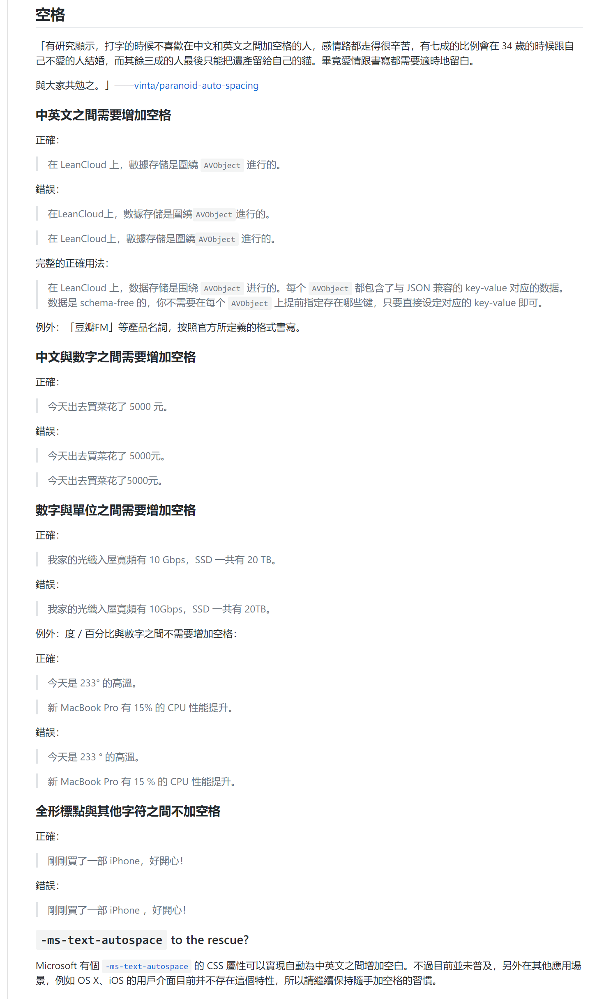
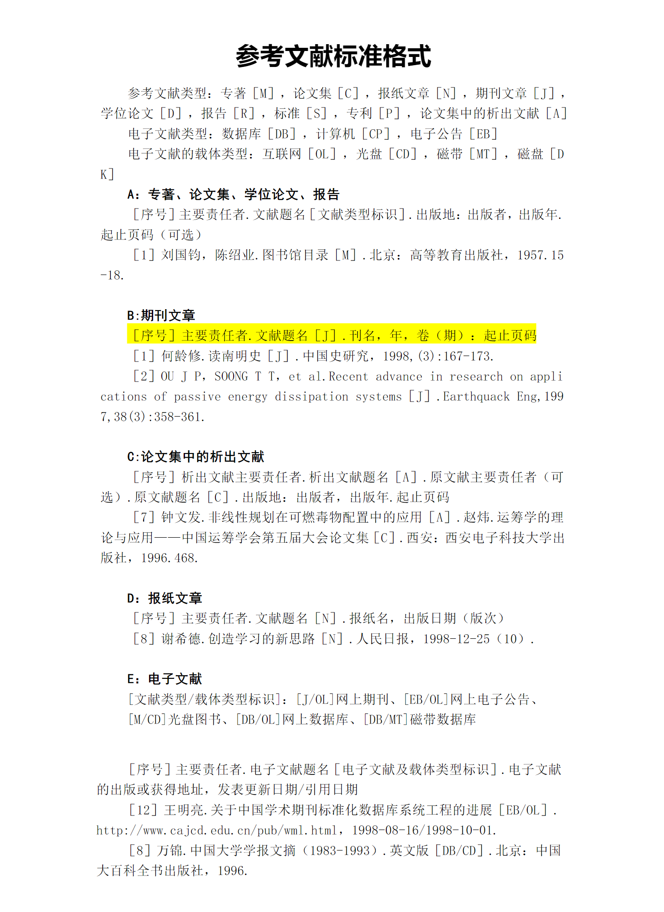

## 排版

偶然发现的一个排版方案：[中文文案排版指北](https://github.com/sparanoid/chinese-copywriting-guidelines)。虽然只是简单地加几个空格，纠正几个标点、字体，但给人的效果却是截然不同。

下面是摘录的一部分。

<!-- more -->

## 参考文献格式

[论文参考文献格式来源](https://wenku.baidu.com/view/6954e68583d049649b665840.html)

## Chrome 网页长截图

`F12` 进入开发者模式，使用组合快捷键 `Ctrl` + `Shift` + `P` 搜索 `Capture full size screenshot`，稍等几秒钟，即可选择保存路径，将完整网页保存为图片。

本文使用的两张图片都是以这种方法截取的。如果想要保存网页为 PDF，那么可以按照 [这里](https://cwwang15.github.io/2018/06/22/%E6%AF%8F%E5%91%A8%E5%88%86%E4%BA%AB%E7%AC%AC%E4%B8%89%E6%9C%9F/) 的方法（仅限百度文库）。