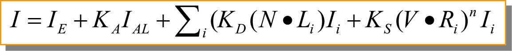

## 损失厌恶

丢失 100 元的难过和获得100 元的喜悦相比，哪一个更大？

损失厌恶偏差告诉我们：我们对那些可能失去的、已经失去的东西，要比可能得到的、已经得到的同等东西，更为敏感、更为关注。

<!-- more -->

## 锚定效应

面试官问你预期薪水多少，如果你对这家公司不太了解、对自己的价值也缺乏充分预估，这时候对方说“你觉得 6k 如何？”，我们就很可能以 6K 为“锚”，再怎么争取，也是以 6K 为基准。

## WebGL 实现 Phong shading

### 计算公式



### 效果展示

[外部链接](http://www.cs.toronto.edu/~jacobson/phong-demo/)

### vertex shader

```vert
attribute vec3 position;
attribute vec3 normal;
uniform mat4 projection, modelview, normalMat;
varying vec3 normalInterp;
varying vec3 vertPos;

void main(){
  vec4 vertPos4 = modelview * vec4(position, 1.0);
  vertPos = vec3(vertPos4) / vertPos4.w;
  normalInterp = vec3(normalMat * vec4(normal, 0.0));
  gl_Position = projection * vertPos4;
}
```

### fragment shader

```
precision mediump float;
varying vec3 normalInterp;  // Surface normal
varying vec3 vertPos;       // Vertex position
uniform int mode;   // Rendering mode
uniform float Ka;   // Ambient reflection coefficient
uniform float Kd;   // Diffuse reflection coefficient
uniform float Ks;   // Specular reflection coefficient
uniform float shininessVal; // Shininess
// Material color
uniform vec3 ambientColor;
uniform vec3 diffuseColor;
uniform vec3 specularColor;
uniform vec3 lightPos; // Light position

void main() {
  vec3 N = normalize(normalInterp);
  vec3 L = normalize(lightPos - vertPos);

  // Lambert's cosine law
  float lambertian = max(dot(N, L), 0.0);
  float specular = 0.0;
  if(lambertian > 0.0) {
    vec3 R = reflect(-L, N);      // Reflected light vector
    vec3 V = normalize(-vertPos); // Vector to viewer
    // Compute the specular term
    float specAngle = max(dot(R, V), 0.0);
    specular = pow(specAngle, shininessVal);
  }
  gl_FragColor = vec4(Ka * ambientColor +
                      Kd * lambertian * diffuseColor +
                      Ks * specular * specularColor, 1.0);
}
```

> Tips：变量命名最好还是按照《WebGL 编程指南》标准，varying 以 v_ 开头，uniform 以 u_ 开头，attribute 以 a_ 开头。

## 矩阵变换与坐标系变换

$\left[\begin{matrix} \cos\theta & -\sin \theta \newline \sin \theta & \cos\theta  \end{matrix}\right]$ 表示的是旋转矩阵。它表示的是将坐标以 $[\cos\theta, \sin\theta]^T$ 和 $[-\sin\theta, \cos\theta]^T$ 为基底的坐标系 1，转换到以 $\left( \begin{matrix} 1 \newline 0 \end{matrix}\right)$ 和 $\left( \begin{matrix} 0 \newline 1 \end{matrix}\right)$ 为基底的坐标系 2。

对应到 WebGL 中的坐标转换，其实就是物体坐标系（坐标系 1）到世界坐标系（坐标系 2）的转换。

$\left[ \begin{matrix} \alpha' \newline \beta' \end{matrix}\right] = \left[\begin{matrix} \cos\theta & -\sin \theta \newline \sin \theta & \cos\theta  \end{matrix}\right] \left[ \begin{matrix} \alpha \newline \beta \end{matrix}\right]$，即表示物体坐标系下表示的点 $(\alpha, \beta)$，转换到世界坐标系下对应的位置 $(\alpha', \beta')$ 。


