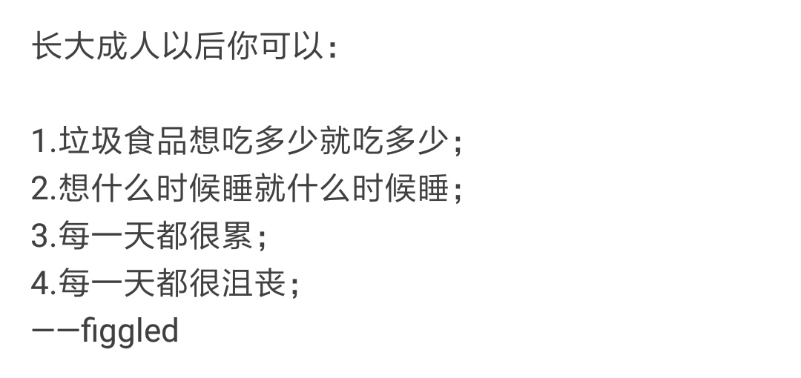
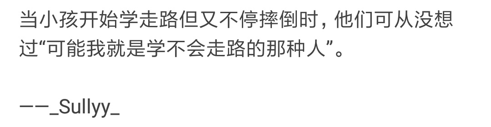
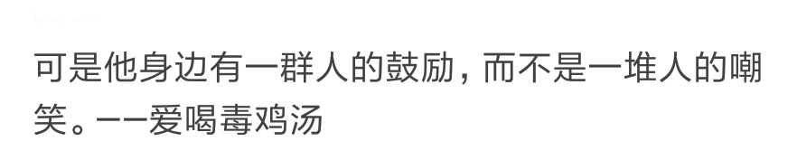
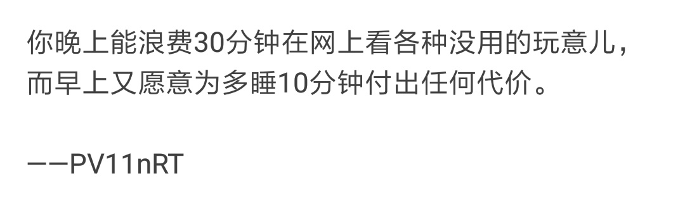

有时会读到一些话，如果不记下来，就太可惜了。

所以，就有了行道树广场系列。

在这个系列里不会有太多关于技术的讨论，更多的是在学习技术的过程中的一些感想与体会。

<!-- more -->

## 成长

> 长大成人以后你可以：
>
> 1. 垃圾食品想吃多少就吃多少；
> 2. 想什么时候睡就什么时候睡；
> 3. 每一天都很累；
> 4. 每一天都很沮丧。

## 成长

> 当小孩开始学走路但又不停摔倒时，他们可从没想过“可能我就是学不会走路的那种人”。
>
> 可是他身边有一群人的鼓励，而不是一堆人的嘲笑。

## 成长

> 你晚上能浪费 30 分钟在网上看各种没用的天地玩意儿，而早上又愿意为多睡 10 分钟付出任何代价。