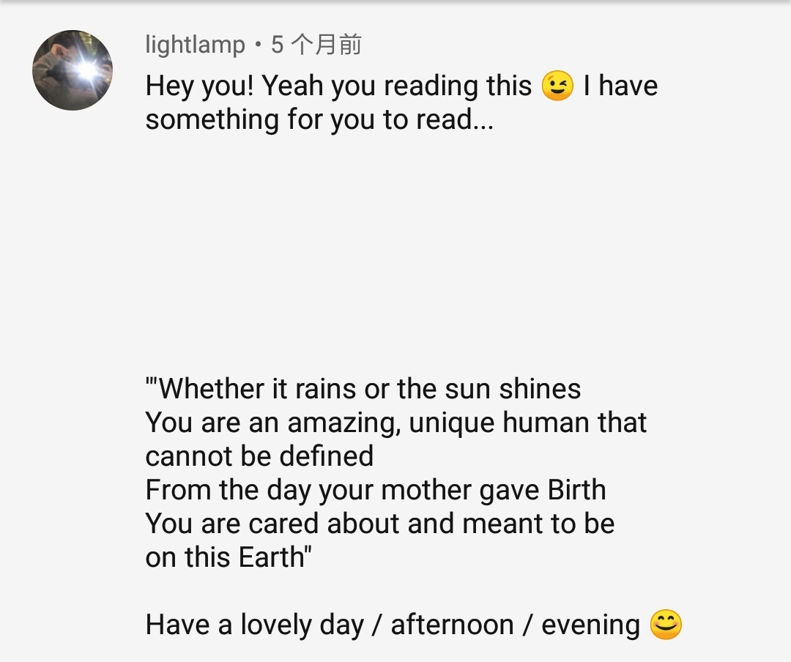

## 自律

> 怎么样算是自律呢？
>
> 走极端不是自律，走极端很容易。
>
> 有 **节制**、**负责任** 地做事，是自律，**自律是发自内心的**。

<!-- more -->

## 渺小

你知道应该在什么场合承认自己的渺小？

在上帝面前，

在智慧面前，

在美面前，

在大自然面前，

但不是在人群面前。

在人群中应该意识到 <b>自己的尊严</b>。

## 祝福

Hey you! Yeah you reading this &#x1F609; I have something for you to read...

 

 

 

"Whether it rains or the sun shines, you are an amazing, unique human that cannot be defined. From the day your mother gave Birth, you are cared about and meant to be on this Earth."

Have a lovely day / afternoon / evening &#x1F60A;

