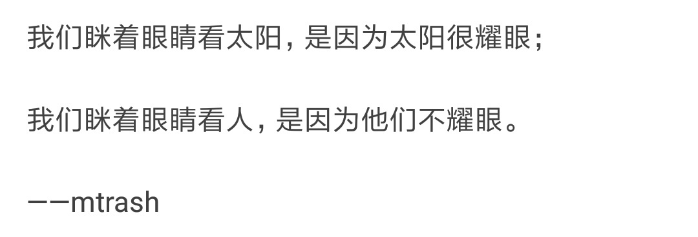
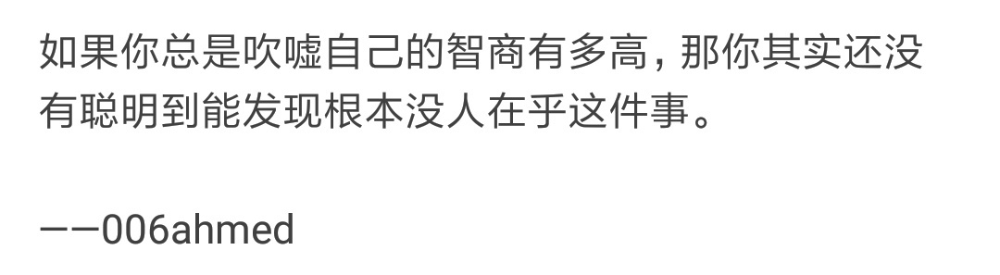
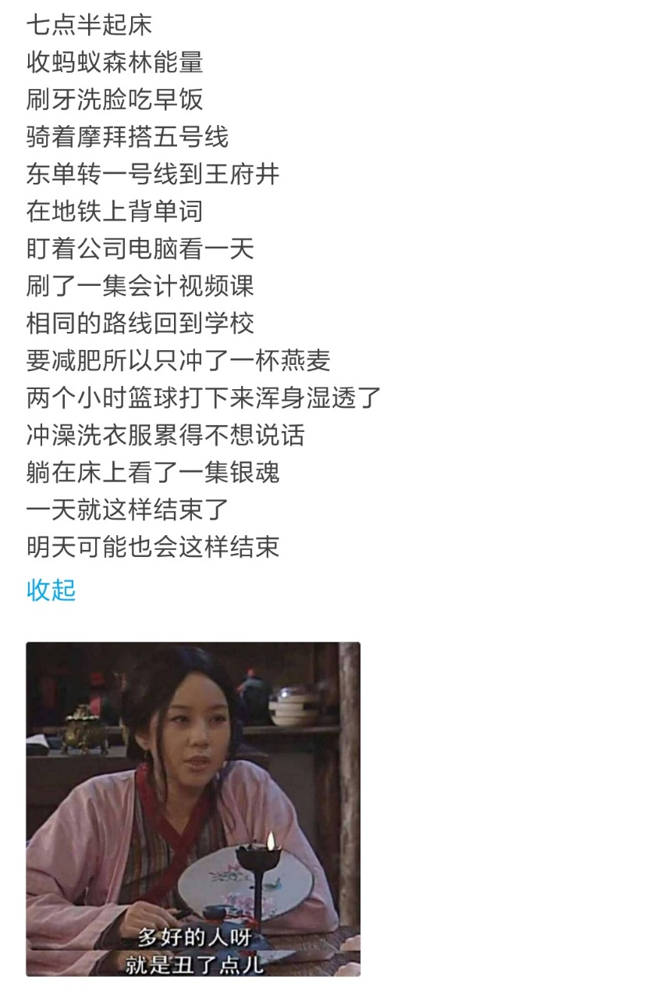

## 太阳

<!-- more -->

> 我们眯着眼睛看太阳，是因为太阳很耀眼；
>
> 我们眯阗眼睛看人，是因为他们不耀眼。

----

## 智者

> 如果你总是吹嘘自己的智商有多高，那你其实还没有聪明到能发现根本没人在乎这件事。

----

## 明天

> 七点半起床
>
> 收蚂蚁森林能量
>
> 刷牙洗脸吃早饭
>
> 骑着摩拜搭五号线
>
> 东单转一号线到王府井
>
> 在地铁上背单词
>
> 盯着公司电脑看一天
>
> 刷了一集会计视频课
>
> 相同的路线回到学校
>
> 要减肥所以只冲了一杯燕麦
>
> 两个小时篮球打下来浑身湿透了
>
> 冲澡洗衣服累得不想说话
>
> 一天就这样结束了
>
> 明天可能也会这样结束

一天就这样结束了。

明天可能也会这样结束。