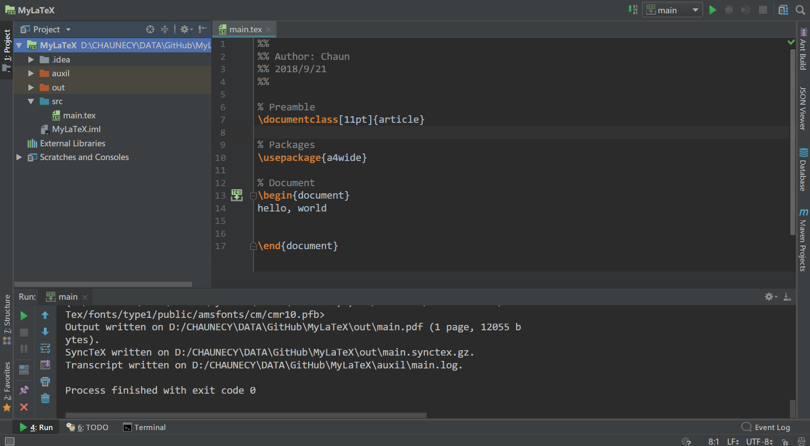

[英文版教程](https://github.com/Ruben-Sten/TeXiFy-IDEA#installation-instructions) 在这里，包括 Windows、Linux、Mac 系统的安装说明。

以下安装流程**仅针对 Windows 系统**。

## 安装 IntelliJ IDEA 与 TeXiFy-IDEA 插件

- 下载 [IntelliJ IDEA](https://www.jetbrains.com/idea/download/#section=windows)， 社区版是免费的。
- 下载安装 [LaTeX for Windows](https://miktex.org/download)，安装过程中注意安装选项，选择 `install missing packages on the fly: yes`。（大致是这个意思，见到 install missing packages 就选 yes 就好了）<!-- more -->
- 下载安装 PDF 阅读器 [SumatraPDF](https://www.sumatrapdfreader.org/download-free-pdf-viewer.html)。
- 启动 IntelliJ IDEA，首次启动时会展示欢迎页菜单，选择 `Configure - Plugins`；或者你已经打开了一个项目，选择 `File - Settings - Plugins`。
- 搜索 `texify`，点击 `search in repositories`，选中 `TeXiFy-IDEA` 并点击右侧的 `install`。
- 重启 IntelliJ IDEA 以完成插件的安装。
- 在欢迎页菜单点击 `Create New Project` 或者在已打开的项目中选择 `File - New - Project`，选中左侧列表中的 `LaTeX` 并点击 `next`。为你的项目指定一个项目名与路径。一个项目可以包含多个 LaTeX 文件。
- 新建完成后，`src` 目录下有一个 `main.tex` 文件。所有的 LaTeX 文件都要放在 `src` 目录下。
  
- 打开 `.tex` 文件，在 `\begin{document}` 和 `\end{document}` 之间写入任意字符串，点击行号右侧的按钮 `Run`，耐心等待，如果一段时间后在 `out` 目录下出现 `.pdf` 文件，那么你可以关闭这个教程了。
- 如果出现错误，类似于 `Error running 'Exercise01': Cannot run program "pdflatex`，那么应该是安装完 `LaTeX` 后还没有重启计算机，重启一下就好了。
- 如果是其他错误，因尚未遇到，不能给出解决方案。