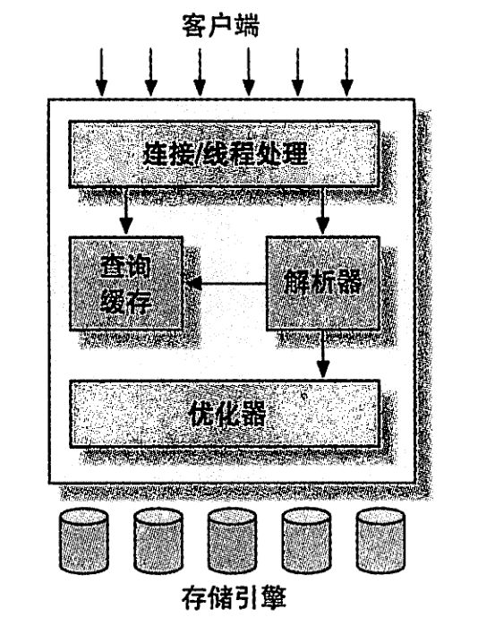
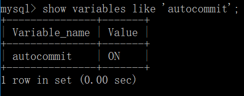
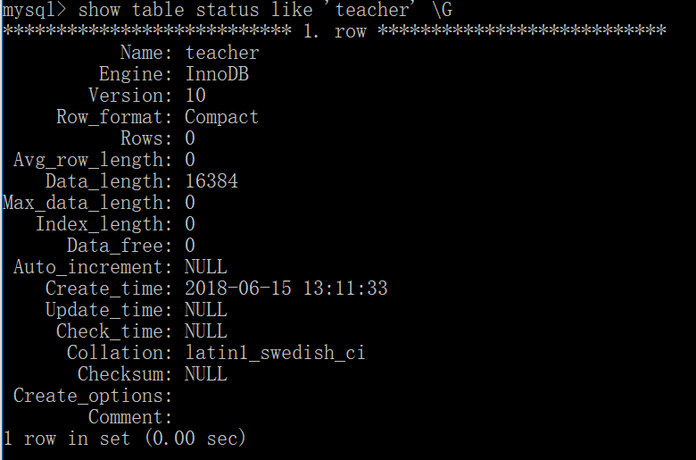

## MySQL  逻辑架构



<!-- more -->

## 并发控制

无论何时，只要有多个查询需要在同一时刻修改数据，都会产生并发控制问题。

在处理并发读或者写时，可以通过实现一个由两种类型的锁组成的锁系统来解决问题。这两种类型的锁通常被称为共享锁（shared lock）和排他锁（exclusive lock），也叫读锁（read lock）和写锁（write lock）。

读锁是共享的，或者说是相互不阻塞的。

写锁则是排他的，也就是说一个写锁会阻塞其他的写锁和读锁。只有这样，才能确保在给定的时间里，只有一个用户能执行定稿，并防止其他用户读取正在写入的同一资源。

### 锁粒度

让锁定对象更有选择性是一种提高共享资源并发性的方式。

锁策略就是在锁的开销和数据的安全性之间寻求平衡。

表锁（table lock）：最基本的锁策略，开销最小的策略。

行级锁（row lock）：最大程度地支持并发处理，最大的锁开销。

## 事务

事务就是一组原子性的 SQL 查询，或者说一个独立的工作单元。事务内的语句，要么全部执行成功，要么全部执行失败。

ACID 表示：

- 原子性（atomicity）：整个事务中的所有操作要么全部提交成功，要么全部失败回滚。
- 一致性（consistency）
- 隔离性（isolation）：通常来说，一个事务所做的修改在最终提交以前，对其他事务是不可见的。
- 持久性（durability）：一旦事务提交，则其所做的修改应付永久保存到数据库中。

### 隔离级别

有四种隔离级别：

- READ UNCOMMITTED（未提交读）

  事务可以读取未提交的数据，也被称为脏读（Dirty Read）。

- READ COMMITTED（提交读）

  一个事务开始时，只能“看见”已经提交的事务所做的修改。也叫不可重复读（nonrepeatable read）。

- REPEATABLE READ（可重复读）

  解决了脏读的问题，保证在同一个事务中多次读取同样记录的结果是一致的。但理论上，可重复读隔离级别还是无法解决另一个幻读（Phantom Read）的问题。

  > 幻读：当某个事务在读取某个范围内的记录时，另外一个事务又在该范围内插入了新的记录，当之前的事务再次读取某个范围内的记录时，另外一个事务又在该范围内插入了新的记录，当之前的事务再次读取该范围的记录是，会产生幻行（Phantom Row）。

  MySQL 默认事务隔离级别

- SERIALIZABLE（串行化）

  强制事务串行执行，避免幻读。在读取的每一行数据上都加锁，可能导致大量的超时和锁争用问题。

### 死锁

解决方式之一：当查询的时间达到锁等待超时的设定后放弃锁请求。

InnoDB 的方法是，将持有最少行级排他锁的事务进行回滚。

死锁发生以后，只有部分或者完全回滚其中一个事务，才能打破死锁。

### 事务日志

事务日志持久以后，内存中被修改的数据在后台可以慢慢地刷回磁盘。通常称之为预写式日志（Write-Ahead Logging）。

### MySQL 中的事务

MySQL 提供了两种事务型的存储引擎：InnoDB 和 NDB Cluster。

#### 自动提交

如果不是显式地开始一个事务，则每个查询都被当作一个事务执行操作。



当 `AUTOCOMMIT = 0` 时，所有的查询都是一个事务中，直到显式地执行 `COMMIT` 提交或者 `ROLLBACK` 回滚，该事务结束，同时又开始了另一个新事务。修改 `AUTOCOMMIT` 对非事务型的表，比如 MyISAM 或者内存表，不会有任何影响。

另外还有一些命令，在执行之前会强制执行 `COMMIT` 提交当前的活动事务。

比如在数据定义语言（DDL）中的 `ALTER TABLE`。

#### 隐式和显式锁定

除了事务中禁用了 `AUTOCOMMIT`，可以使用 `LOCK TABLES` 之外，其他任何时候都不要显式地执行 `LOCK TABLES`，不管使用的是什么存储引擎。

## 多版本并发控制

可以认为 MVCC 是行级锁的一个变种，但是它在很多情况下避免了回销操作。实现机制有所不同，但大都实现了非阻塞的读操作，写操作也只锁定必要的行。

MVCC 的实现，是通过保存数据在某个时间点的快照来实现的。也就是说，不管需要执行多长时间，每个事务看到的数据都是一致的。根据事务开始的时间不同，每个事务对同一张表，同一时刻看到的数据可能是不一样的。

MVCC 的实现，典型的有乐观并发控制和悲观并发控制。

InnoDB 的 MVCC，是通过在每行记录后面保存两个隐藏的列来实现的。这两个列，一个保存了行的创建时间，一个保存行的过期时间（或删除时间）。存储的并不是实际的时间值，而是系统版本号（system version number）。每开始一个新的事务，系统版本号都会自动递增。事务开始时刻的系统版本号会作为事务的版本号，用来和查询到的每行记录的版本号进行比较。

在 REPEATABLE READ 隔离级别下，MVCC 具体操作：

- SELECT

  InnoDB 根据以下两个条件检查每行记录：

  - InnoDB 只查找版本早于当前事务版本的数据行（也就是，行的系统版本号小于或等于事务的系统版本号），这样可以确保事务读取的行，要么是在事务开始前已经存在的，要么是事务自身插入或者修改过的。
  - 行的删除版本要么未定义，要么大于当前事务版本号。这可以确保事务读取到的行，在事务开始之前未被删除。

  只有符合上述两个条件的记录，才能返回作为查询结果。

- INSERT

  InnoDB 为新插入的每一行保存当前系统版本号作为行版本号。

- DELETE

  InnoDB 为删除的每一行保存当前系统版本号作为行删除标识。

- UPDATE

  InnoDB 为插入一行新记录，保存当前系统版本号作为行版本号，同时保存当前系统版本号到原来的行作为行删除标识。

保存两个额外系统版本号，使大多数读操作都可以不用加锁。

不足之处是每行记录都需要额外的存储空间，需要做更多的行检查工作，以及一些额外的维护工作。

MVCC 只在 REPEATABLE READ 和 READ COMMITTED 两个隔离级别下工作。其他两个隔离级别都和 MVCC 不兼容，因为 READ UNCOMMITTED 总是读取最新的数据行，而不是符合当前事务版本的数据行。而 SERIALIZABLE 则会对所有读取的行都加锁。

## MySQL 的存储引擎

在文件系统中，MySQL 将每个数据库（也可以称之为 schema）保存为数据目录下的一个子目录。创建表时，MySQL 会在数据库子目录下创建一个和表同名的 .frm 文件保存表的定义。



### InnoDB 存储引擎

InnoDB 是 MySQL 的默认事务型引擎，也是最重要、使用最广泛的存储引擎。它被设计用来处理大量的短期（short-lived）事务，短期事务大部分情况是正常提交的，很少会被回滚。

### InnoDB 概览

InnoDB 采用 MVCC 来支持高并发，并且实现了四个标准的隔离级别。其默认级别是 REPEATABLE READ （可重复读），并且通过间隙锁（next-key locking）策略防止幻读的出现。间隙锁使得 InnoDB 不仅仅锁定查询涉及的行，还会对索引中的间隙进行锁定，以防止幻影行的插入。

InnoDB 表是基于聚簇索引建立的。聚簇索引对主键查询有很高的性能，不过它的二级索引（secondary index，非主键索引）中必须包含主键列，所以如果主键列很大的话，其他的所有索引都会很大。InnoDB 的存储格式是平台独立的。

InnoDB 的行为是非常复杂的，如果使用 InnoDB 引擎，阅读官方手册中的“InnoDB 事务模型和锁”一节。

### MyISAM 存储引擎

不支持事务和行级锁，崩溃后无法安全恢复。

#### 存储

MyISAM 会将表存储在两个文件中：数据文件和索引文件，分别以 .MYD 和 .MYI 为扩展名。

#### MyISAM 特性

- 加锁与并发
- 修复
- 索引特性
- 延迟更新索引键

#### MyISAM 压缩表

如果表在创建并导入数据后，不会再进行修改操作，那么这样的表或许适合采用 MyISAM 压缩表。

#### MyISAM 性能

最典型的性能问题是表锁。

### 选择合适的引擎

大部分情况下，InnoDB 都是正确的选择。除非需要用到某些 InnoDB 不具备的特性，并且没有其他办法可以替代，否则都应该优先选择 InnoDB 引擎。

### 转换表的引擎

- ALTER TABLE

  ```mysql
  mysql> ALTER TABLE mytable ENGINE = InnoDB
  ```

  适用于任何存储引擎，但执行时间很长。

  如果转换表的存储引擎，将会失去和原引擎相关的所有特性。例如，如果将一张 InnoDB 表转换为 MyISAM，然后再转换回 InnoDB，原 InnoDB 表上所有的外键将丢失。

- 导出和导入

  使用 *mysqldump* 工具将数据导出到文件，然后修改文件中 `CREATE TABLE` 语句的存储引擎选项。

  *mysqldump* 默认会自动在 `CREATE TABLE` 语句前加上 `DROP TABLE` 语句。

- 创建与查询

  先创建一个新的存储引擎的表，然后利用 `INSERT ... SELECT` 语法来导数据。

  ```mysql
  
  ```

  数据量大的情况下，分批处理：

  ```mysql
  mysql> START TRANSACTION;
  mysql> INSERT INTO innodb_table SELECT * FORM myisam_table;
      -> WHERE id BETWEEN x AND y;
  mysql> COMMIT;
  ```

